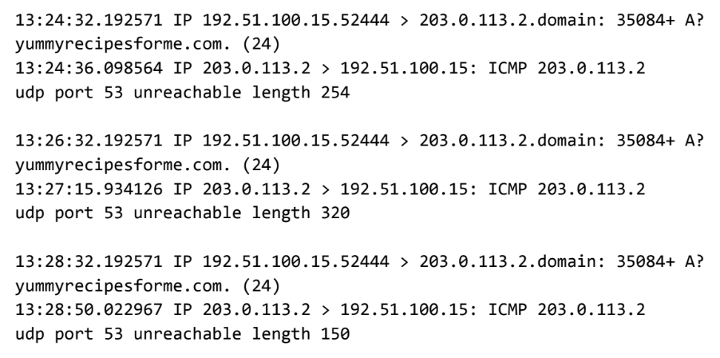

# Cybersecurity Incident Report: Network Traffic Analysis

**Date:** April 29, 2026  
**Time of Incident:** 1:24 PM (13:24:32)  
**Status:** Investigation Phase

## Part 1: Problem Summary

The analysis of the `tcpdump` log reveals a failure in the **DNS resolution process**. 

*   **Request:** The client browser utilized the **UDP protocol** to contact the DNS server (**203.0.113.2**) on **Port 53** to retrieve the 'A' record for `yummyrecipesforme.com`. 
*   **Failure:** In every log event, the initial UDP request (lines 1-2) is met with an **ICMP error response** (lines 3-4) from the DNS server.
*   **Evidence:** The specific error message received was **“udp port 53 unreachable.”** 
*   **Technical Details:** Issues with the DNS protocol are further evidenced by the **Query ID 35084**, where the "+" sign and the **"A?"** symbol indicate flags associated with a standard DNS A-record request.

**Conclusion:** The ICMP error response confirms that while the server is reachable, the DNS service itself is not responding to queries on the standard port.

## Part 2: Analysis and Potential Causes

The incident was reported at **1:24 PM** following multiple customer reports of a “destination port unreachable” error. Initial packet sniffing via `tcpdump` confirms that communication to **DNS Port 53** is being actively rejected by the destination server.

### **Potential Root Causes:**
1.  **Service Outage:** The DNS service on the target server may be down due to a software crash or misconfiguration.
2.  **Firewall Obstruction:** Traffic to Port 53 might be intentionally blocked by a firewall or security group setting.
3.  **Security Incident:** The DNS server may be overwhelmed by a **Denial of Service (DoS)** attack, preventing it from processing legitimate incoming requests.

**Next Steps:** The cybersecurity team will prioritize verifying the status of the DNS service and reviewing firewall logs for recently implemented block rules.

