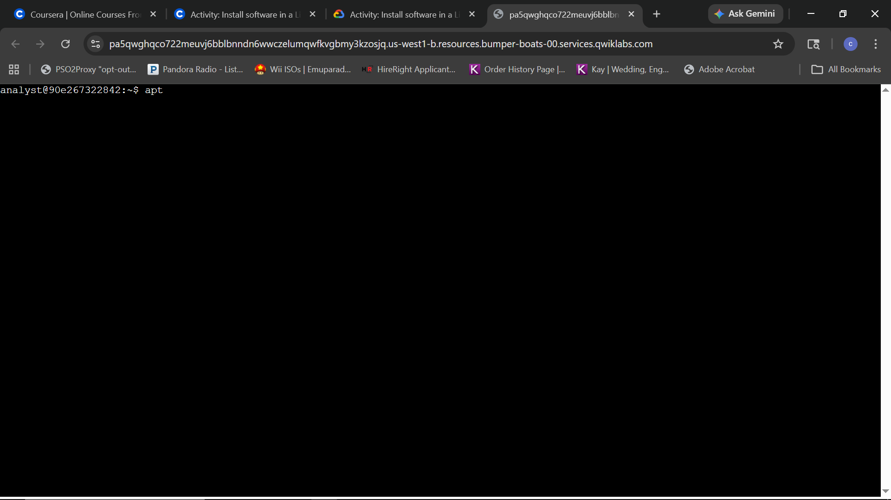
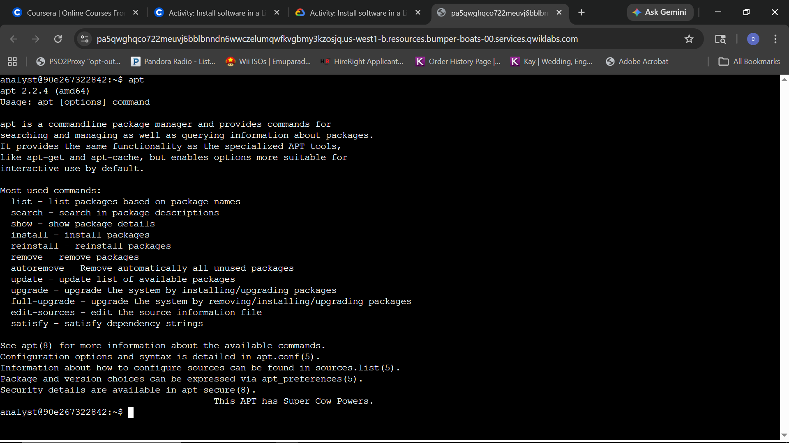
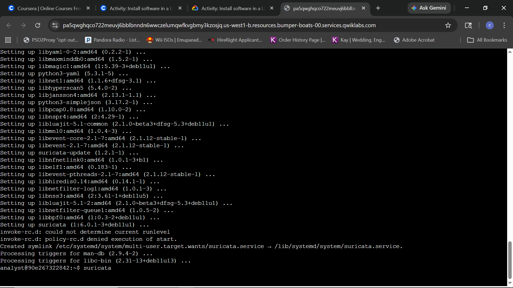
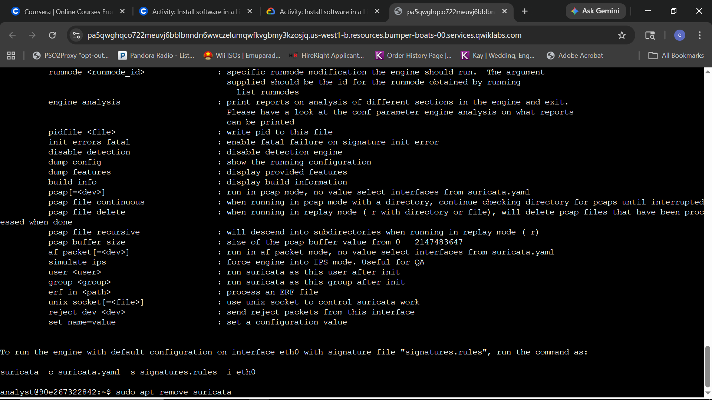
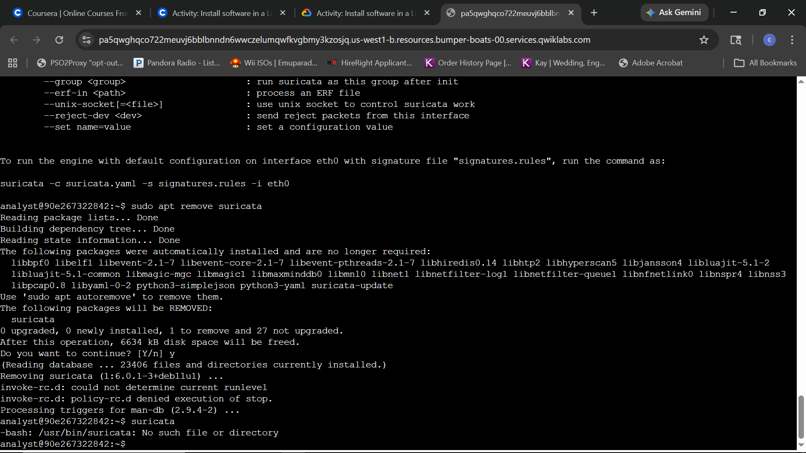
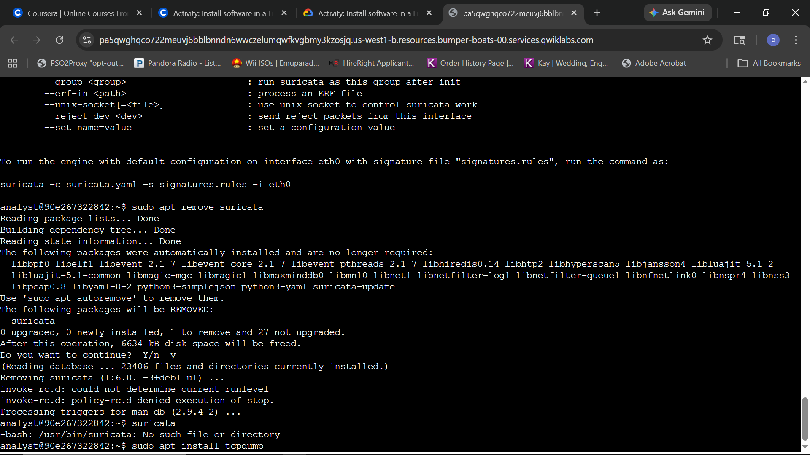
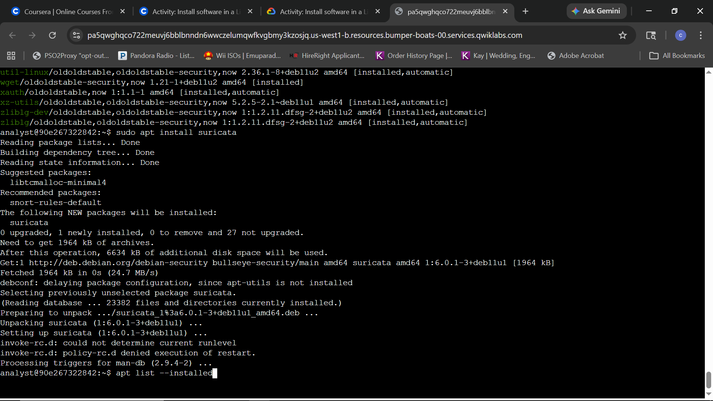
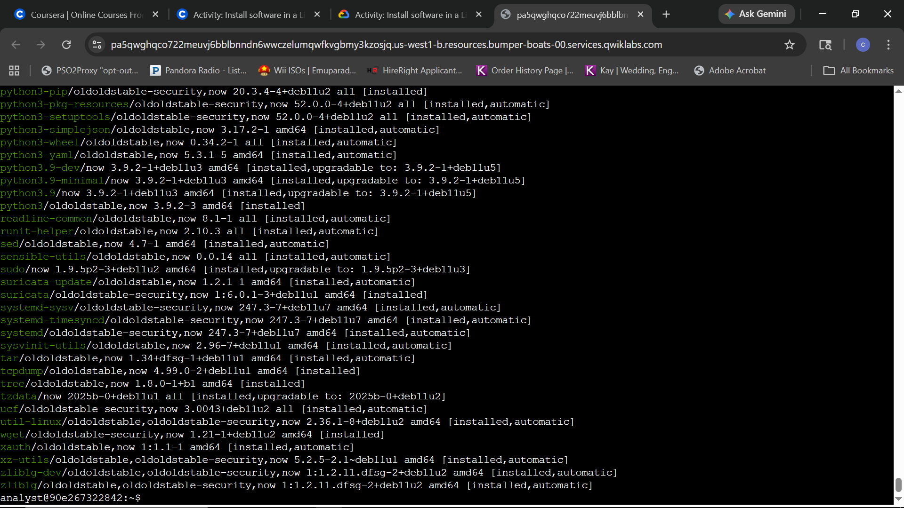

# C4_M2_L1_Linux_Software_Management

**Scenario:** Provisioning and auditing network security tools (**Suricata/tcpdump**) using the **APT** package manager to establish a baseline for network traffic analysis and intrusion detection.

---

### Step 1: Verification of Package Management Tools
**Question:** How do you verify that the APT package manager is active and ready for use in your environment?

**Answer:** Running the `apt` command confirms the package manager's presence. The resulting usage guide and version information indicate that the environment is prepared for software management tasks.

### Step 2: Validating Package Manager Functionality
**Question:** What specific information is returned by the `apt` command to confirm it is ready for system administration tasks?

**Answer:** Running `apt` returns the manual page, versioning (e.g., `apt 2.2.4`), and a list of core administrative commands such as `install`, `remove`, and `update`. This confirms the package manager is operational and ready to handle security tool deployments.

### Step 3: Installing Security Applications
**Question:** How do you initiate the installation of the Suricata application with elevated privileges, and what is the process for confirming the installation of its required dependencies?

**Answer:** Use the command `sudo apt install suricata` to install the application with administrative privileges. When prompted with a list of dependencies (required additional software), press **ENTER** to accept the default "Yes" response and proceed with the installation.

### Step 4: Installation Completion and Verification
**Question:** Once the installation process completes, how do you verify that Suricata is correctly installed and view its basic usage parameters?

**Answer:** Verification is performed by running the command `suricata`. Successful installation is confirmed when the system returns the application's version information and a list of available command-line options rather than a "command not found" error.

### Step 5: Verify that Suricata has been uninstalled
**Question:** How do you verify that Suricata has been uninstalled?

**Answer:** To verify that Suricata has been uninstalled, run the `suricata` command again. If the removal was successful, the output will be an error message: `-bash: /usr/bin/suricata: No such file or directory`. This message indicates that Suricata can no longer be found on the system.

### Step 6: Install the tcpdump application
**Question:** How do you use the APT package manager to install tcpdump?

**Answer:** To install the application, type `sudo apt install tcpdump` after the command-line prompt and press ENTER. This initiates the package manager to fetch and install the network capture tool.

### Step 7: List the installed applications
**Question:** Use the APT package manager to list all installed applications.

**Answer:** Use the command `apt list --installed` after the command-line prompt. This produces a long list of applications because Linux has a lot of software installed by default. You can search through the list to find the applications you installed, such as `tcpdump`.
