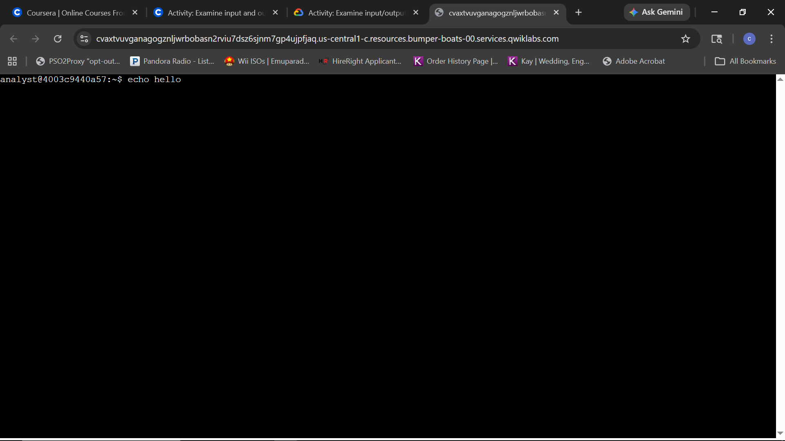
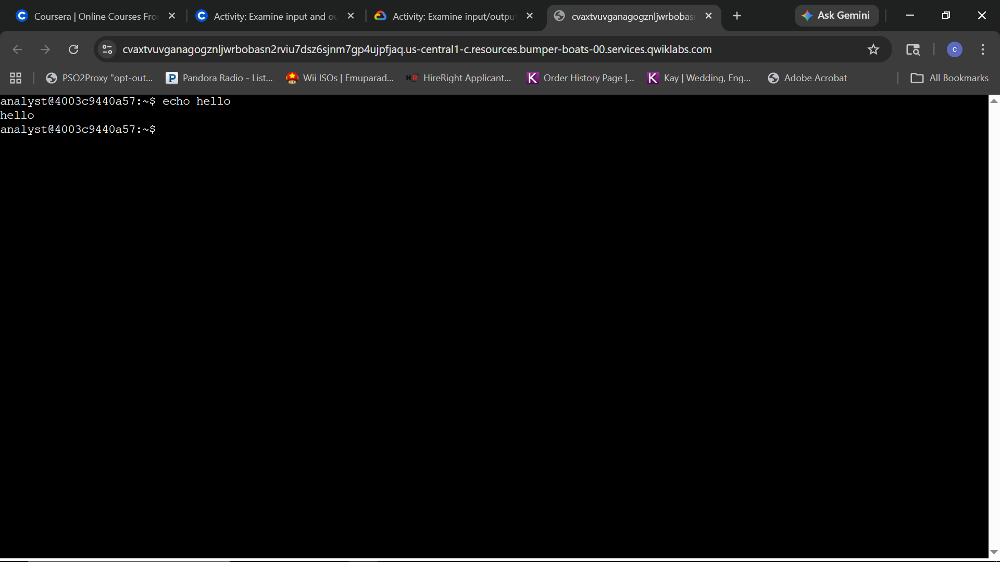
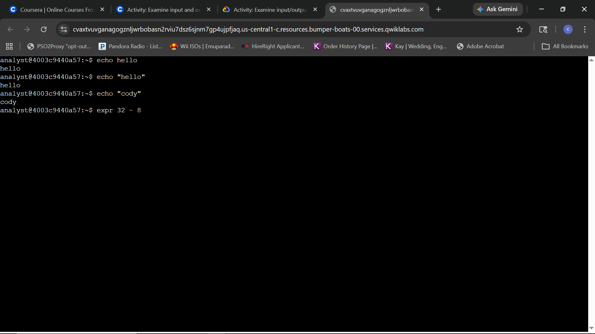
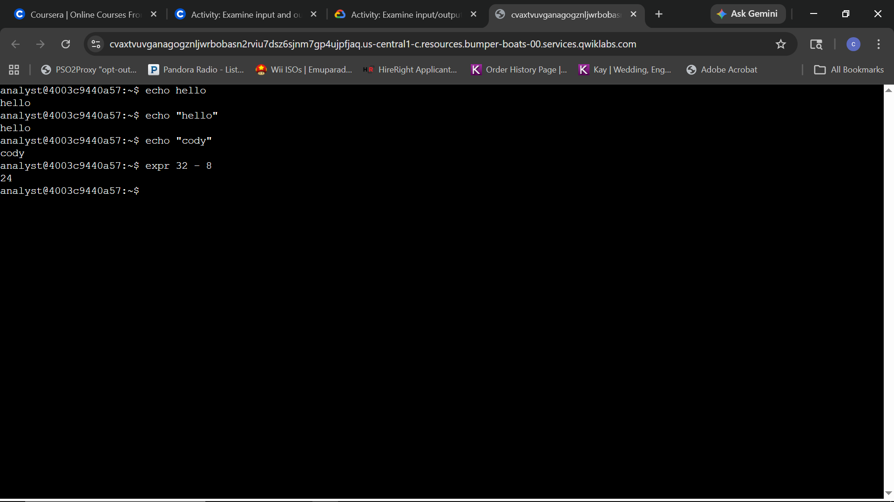
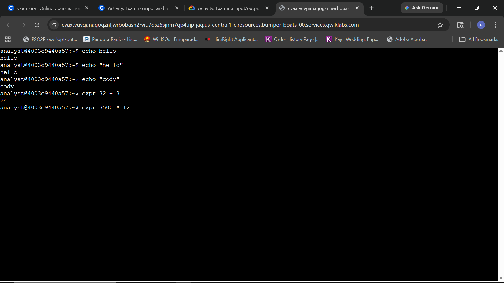
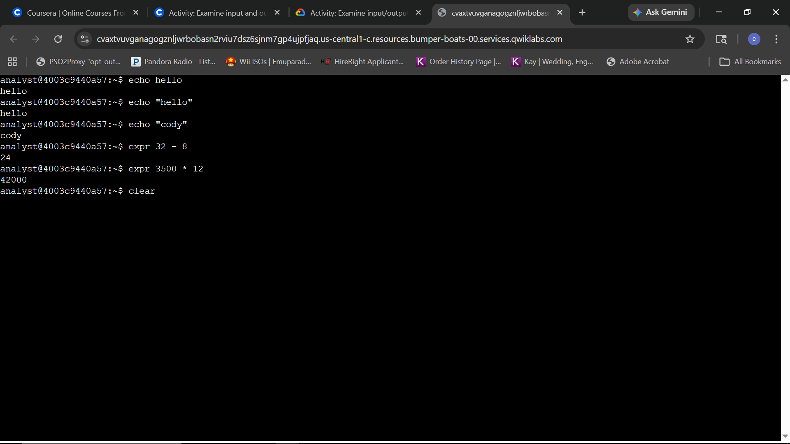
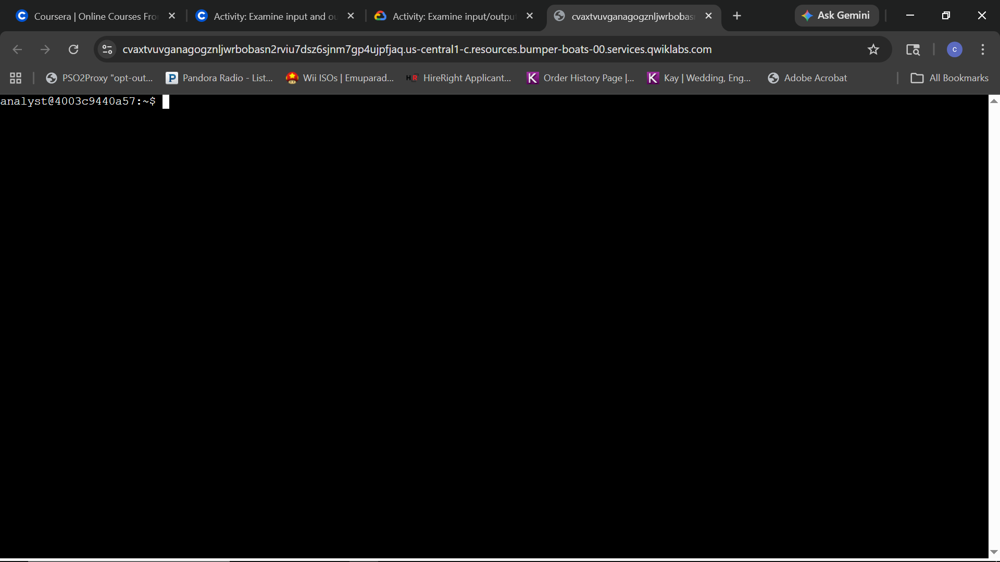

### Step 1: Generate output with the echo command
**Question:** How do you use the `echo` command to examine how input is received and how output is returned in the shell?

**Answer:** To examine input and output, type `echo hello` into the Bash shell. The command itself serves as the input, and the shell's immediate return of the string "hello" represents the output. This confirms a successful communication loop between the user and the operating system.

### Step 2: Generate output with the expr command
**Question:** How do you use the `expr` command to calculate the number of false positive alerts?

**Answer:** To calculate false positives, use the `expr` command followed by the mathematical expression (e.g., `expr 32 - 8`). The shell processes the subtraction and returns the result, which in this scenario identifies 24 false positive alerts for feedback to the configuration team.

### Step 2 (Continuation): Metrics Calculation
**Question:** How do you calculate the total number of logins expected in a year by multiplying the monthly average using the `expr` command?

**Answer:** Use the command `expr 3500 * 12` to calculate the annual projected login attempts based on a monthly average. The shell returns `42000`, demonstrating how command-line arithmetic can be used to quickly generate high-level security metrics.

### Step 3: Clear the Bash shell
**Question:** How do you use the `clear` command to remove existing output and reset the shell window?

**Answer:** Type `clear` into the shell and press ENTER. This command removes all previous input and output from the current view, resetting the cursor to the top of the window and providing a clutter-free environment for ongoing analysis.
