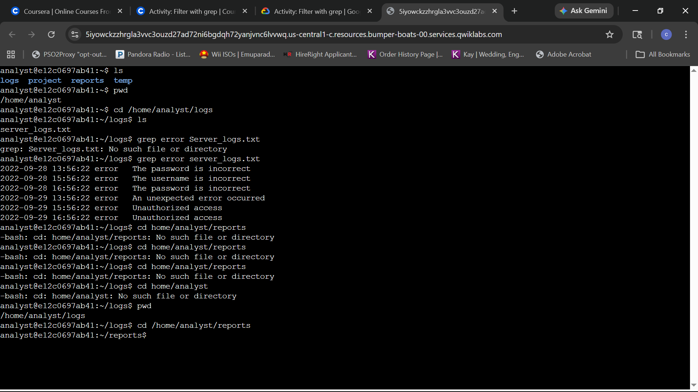
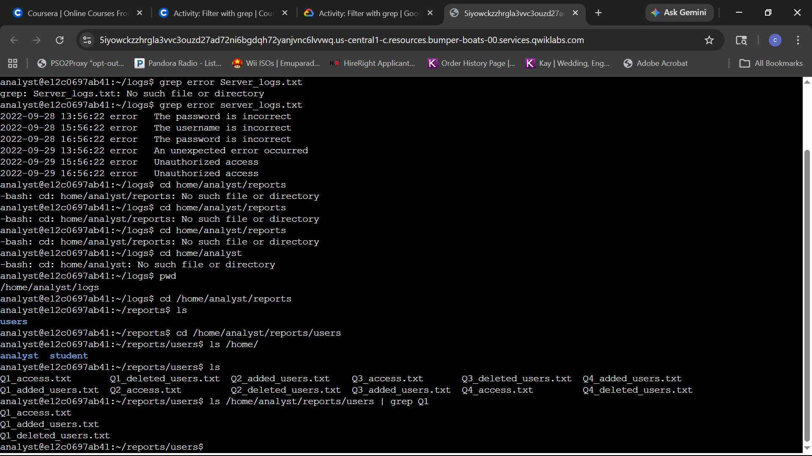
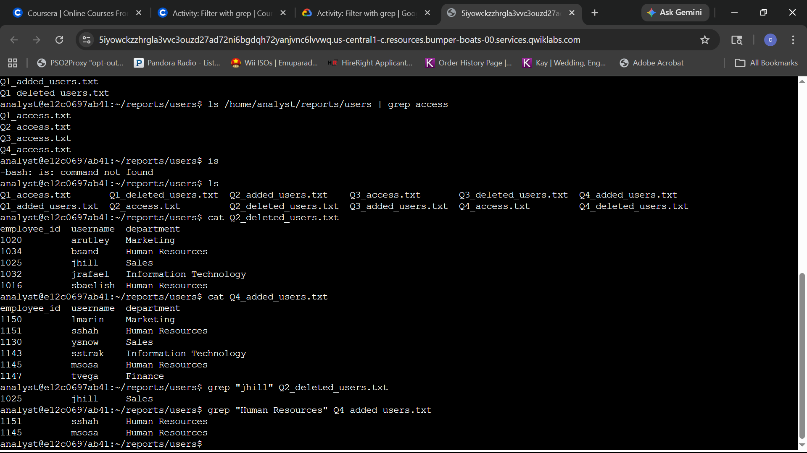

### Task 1: Search for error messages in a log file
**Question:** How do you navigate to the logs directory and use `grep` to filter for specific "error" strings within a server log?

**Answer:** Use `cd /home/analyst/logs` to enter the directory. To filter the log, use `grep "error" server_logs.txt`. 

**Note on Troubleshooting:** 
This task highlighted the importance of **Case Sensitivity** in Linux. An initial attempt to grep `Server_logs.txt` (capital S) failed because the file is named `server_logs.txt` (lowercase). Additionally, when navigating to the next directory, multiple `cd` errors occurred due to pathing typos; these were resolved by slowing down and verifying the absolute path with `pwd`, ultimately landing successfully in the `reports` directory.

### Task 2: Find files containing specific strings
**Question:** How do you use the pipe character (|) to filter the output of the ls command to find files containing specific strings in their names?

**Answer:** To filter directory listings, use the pipe character to send the output of `ls` into `grep`. For example, running `ls /home/analyst/reports/users | grep Q1` isolates only the files containing "Q1" in their names, such as `Q1_access.txt`, `Q1_added_users.txt`, and `Q1_deleted_users.txt`. This technique is essential for quickly locating specific files within a large administrative directory.

### Task 3: Search more file contents
**Question:** How do you search for a specific username in a deleted users file and list users added to a specific department?

**Answer:** Use `grep` followed by the search string in quotes and the filename. In this lab, `grep "jhill" Q2_deleted_users.txt` was used to confirm a specific deletion, and `grep "Human Resources" Q4_added_users.txt` isolated all new hires within that specific department.

**Note:** 
Before filtering, the `cat` command was used to inspect the file structure. This verification step ensured that the search strings ("jhill" and "Human Resources") matched the actual data formatting within the text files, preventing false-negative search results.
