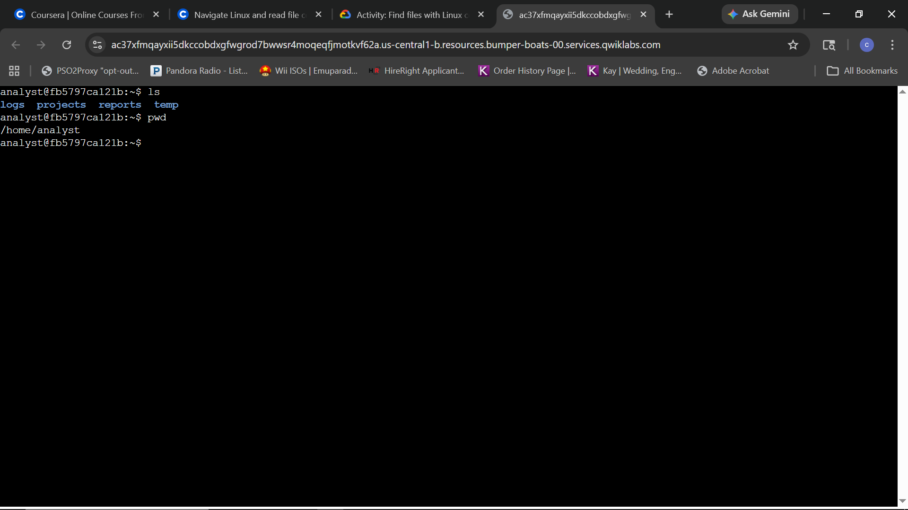
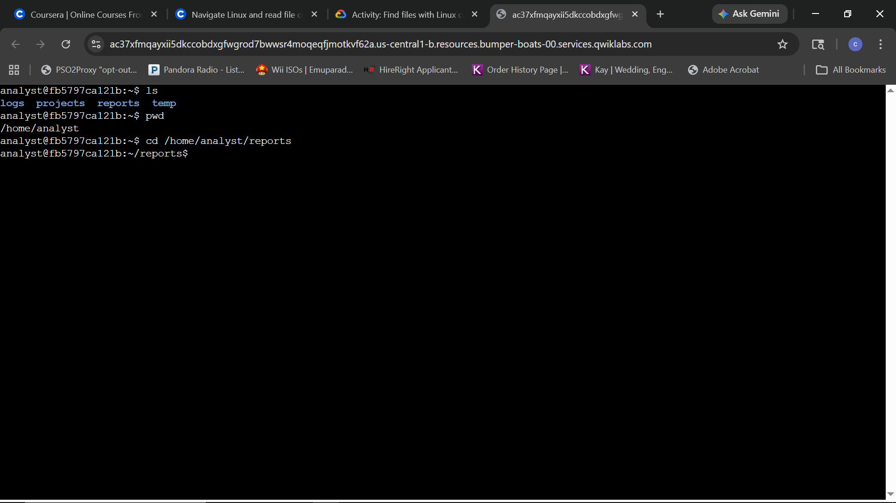
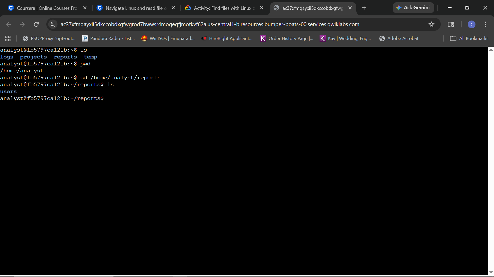
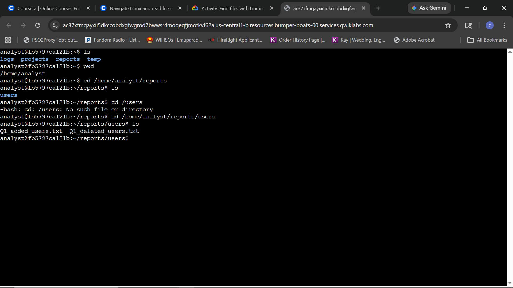
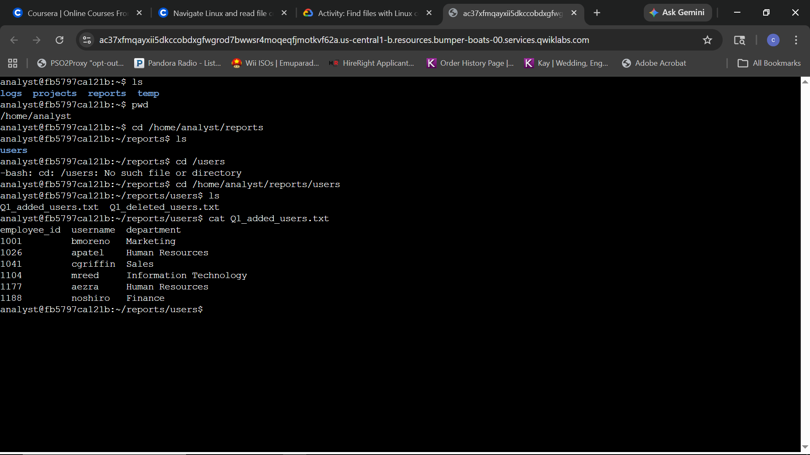
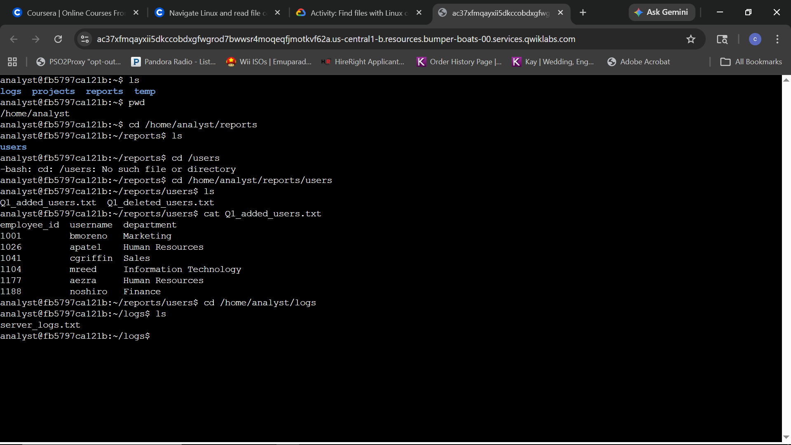
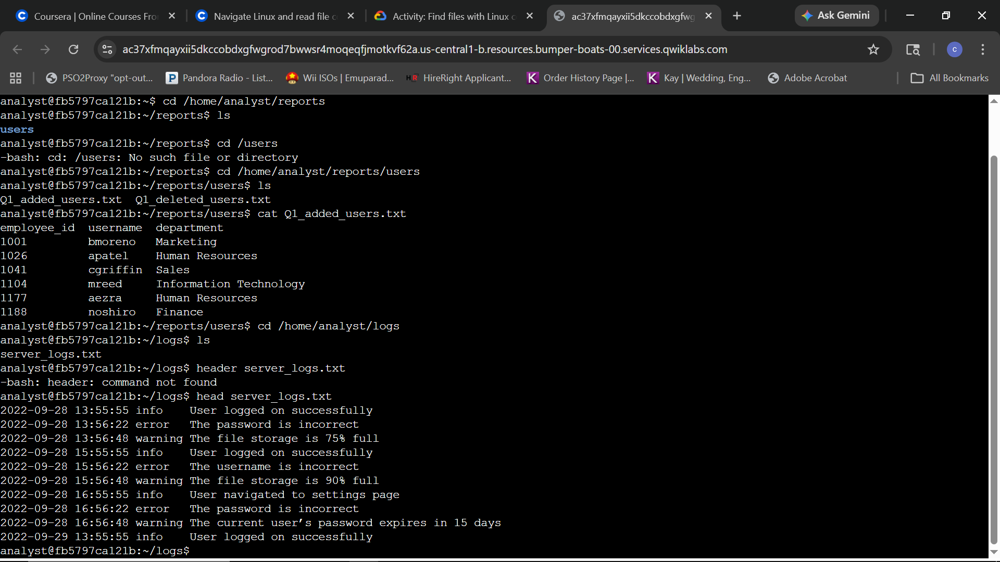

### Step 1: Get the current directory information
**Question:** How do you verify your current location in the filesystem and list the files and directories available in that location?

**Answer:** Use the `pwd` (print working directory) command to display the absolute path of your current location and the `ls` command to list the names of the files and directories it contains. In this scenario, the user is in `/home/analyst`, which contains subdirectories including `logs` and `reports`.

### Step 2: Change directory and list the subdirectories
**Question:** How do you navigate to the reports directory and determine the subdirectories it contains?

**Answer:** Use the `cd` (change directory) command followed by the target path, `cd /home/analyst/reports`, to move into the directory. Once there, execute the `ls` command to display its contents, which in this case confirms the existence of a `users` subdirectory.

### Step 3: Locate and read the contents of a file
**Question:** How do you navigate to a specific subdirectory and display the contents of a targeted text file?

**Answer:** To access a file, navigate to the subdirectory using `cd`. This lab demonstrated troubleshooting a path error by switching from an incorrect absolute path (`/users`) to the valid path (`/home/analyst/reports/users`). Once the location is verified with `ls`, use the `cat` command followed by the filename (e.g., `cat Q1_added_users.txt`) to display the text contents of the file.

### Step 4: Navigate to a directory and locate a file
**Question:** How do you navigate to a new directory, locate a file, and examine its initial contents?

**Answer:** Navigate to the logs directory using `cd /home/analyst/logs` and identify the file `server_logs.txt` with `ls`. To examine the start of the log file, use the `head` command. This lab highlighted the precision required for command syntax; an attempt to use `header` resulted in a "command not found" error, which was corrected by using the proper `head` command to display the first 10 lines of security log data.
