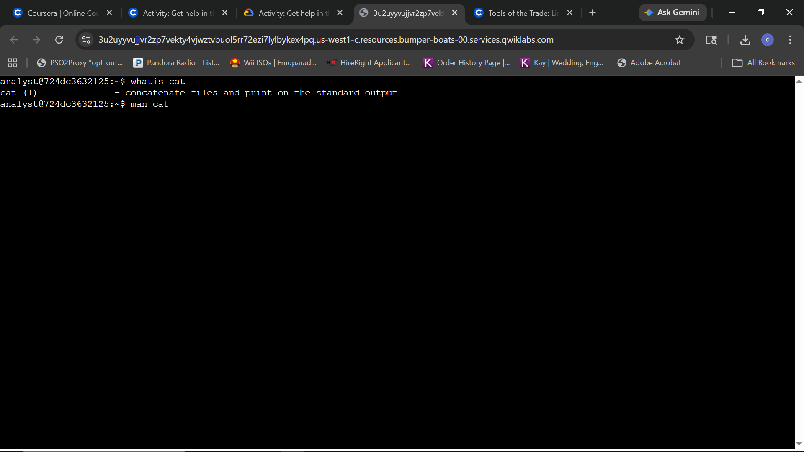
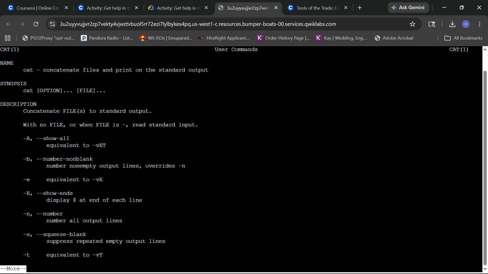
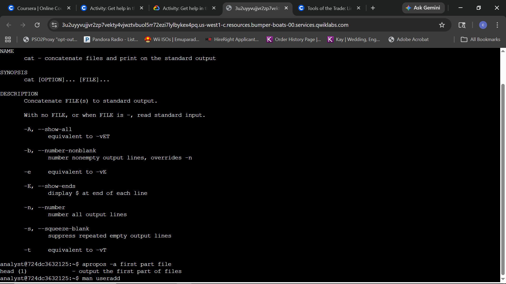
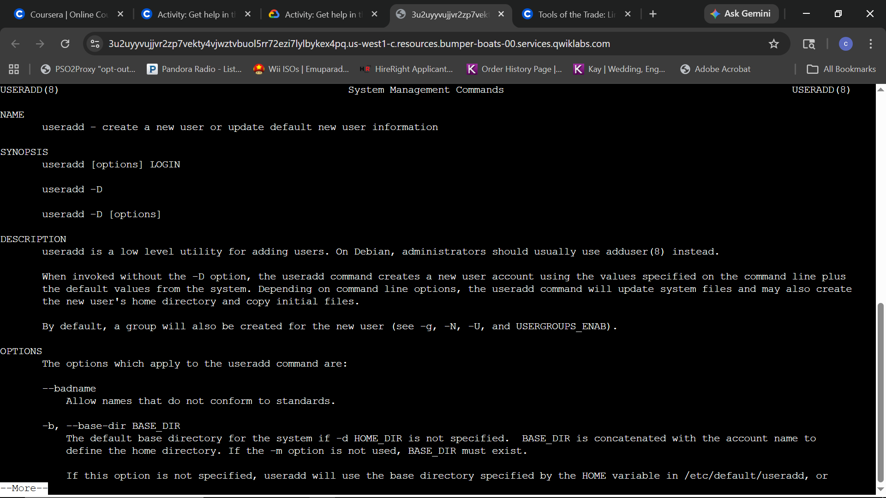
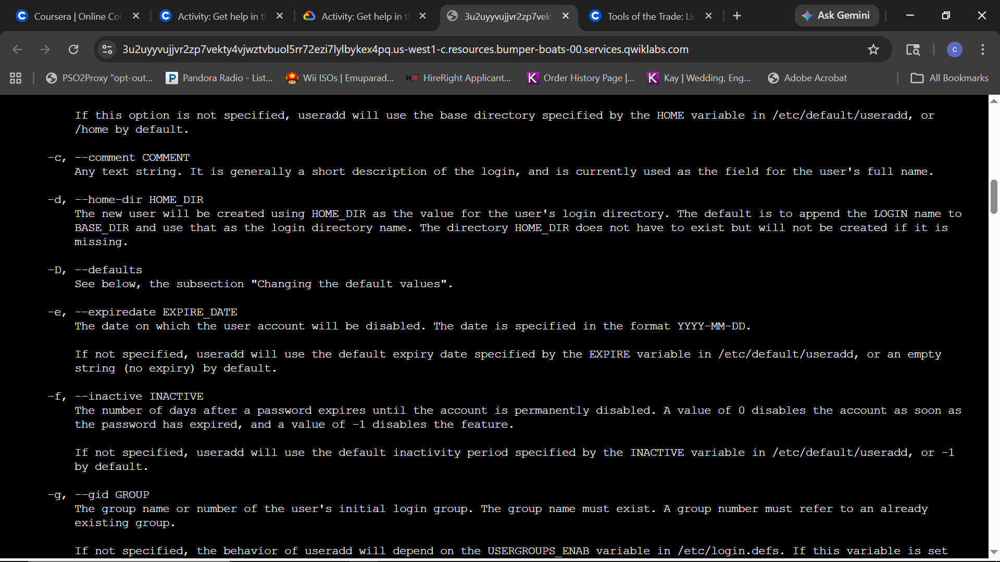
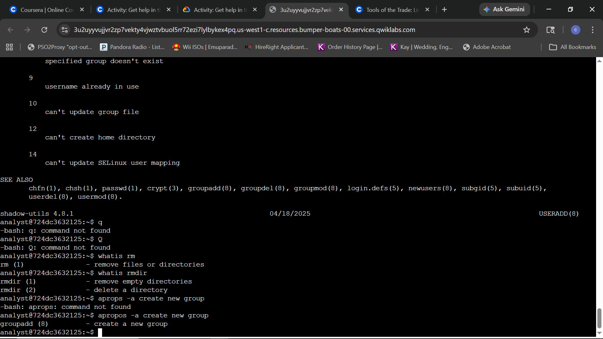

# Lab Report: Get Help in the Command Line

## Scenario
As a security analyst, navigating the Linux environment requires mastery of documentation tools to identify correct command syntax and options. In this scenario, I am using the `man`, `whatis`, and `apropos` utilities to audit command functionality, discover administrative options for user management, and differentiate between file/directory removal tools.

**Objective:** 
Explore documentation commands, identify specific command flags for account security (expiration dates), distinguish between `rm` and `rmdir`, and utilize keyword searches to identify the correct command for group creation.

---

## Task 1: Learn more about commands

**Question:** 
Run the `whatis` command to get a short description of `cat`. Use the `man` command to get more details about `cat`.

**Evidence:**

**Explanation:**
I utilized the `whatis` command to obtain a high-level summary of the `cat` utility, confirming its function for concatenating and printing files. To perform a deeper technical audit of the command's flags and syntax, I executed `man cat`. This opened the manual pager, providing the full documentation necessary for precise command execution in a security context.

---
## Task 1: Learn more about commands (Continued)

**Question:** 
Use `apropos` to find a command that returns the first part of a file using the keywords `first part file`.

**Evidence:**

**Explanation:**
I executed `apropos -a first part file` to identify commands matching specific functional keywords. The system returned `head (1)`, which effectively filters for the beginning of a file. This demonstrated the utility of `apropos` for discovering necessary tools when the exact command name is unknown.

---
## Task 2: Explore the useradd command

**Question:** 
Use the most appropriate Linux command to get help on the `useradd` command and learn more about all of its options, specifically for setting an account expiration date.

**Evidence:**

**Explanation:**
I accessed the manual page for `useradd` using the `man useradd` command to audit available administrative flags. By scrolling through the documentation, I identified the `-e, --expiredate` option. This flag allows a security analyst to specify the exact date a temporary account will be disabled, enforcing time-based access control and reducing the risk of stale accounts in the environment.

---
## Task 3 & 4: Command Differentiation and Functional Search

**Question 3:** 
Use the most appropriate Linux command to quickly remind yourself what the `rm` and `rmdir` commands do.

**Question 4:** 
Use the most appropriate Linux command with the keywords `create new group` to identify what command to use.

**Evidence:**

**Explanation:**
The terminal evidence captures the final audit sequence. I first transitioned out of the `useradd` manual; though I initially entered incorrect exit syntax (upper-case 'Q'), I successfully returned to the prompt. I then executed `whatis rm` and `whatis rmdir` to differentiate their functions, confirming that `rm` handles files and directories generally, while `rmdir` is specialized for empty directories.

Finally, to identify a tool for group management, I utilized `apropos -a create new group`. After correcting an initial syntax error where the command was misspelled, the search successfully identified `groupadd (8)` as the correct administrative utility for creating new groups.
---

