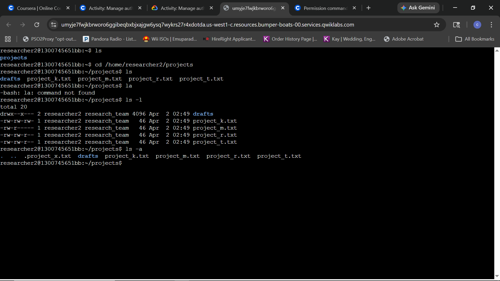
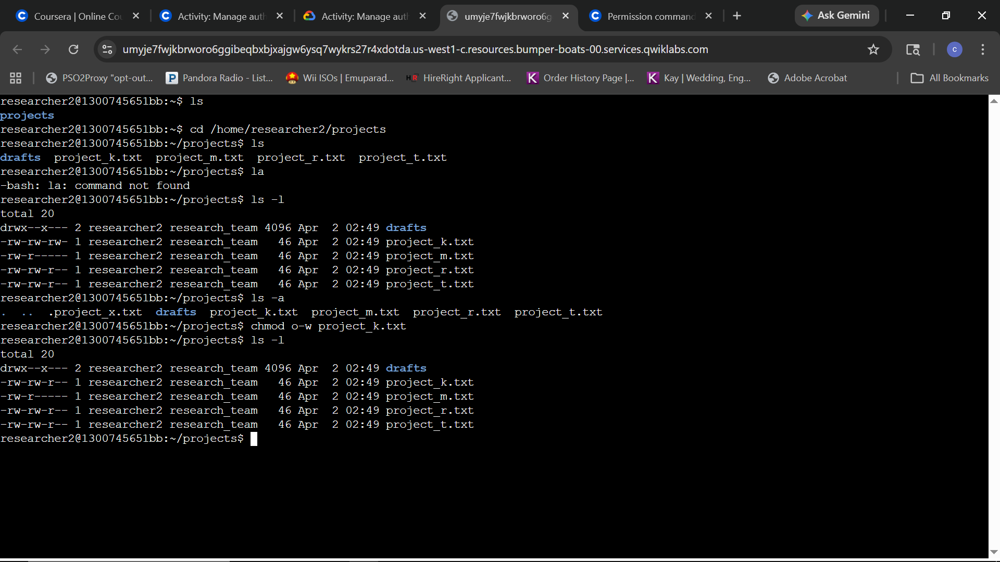
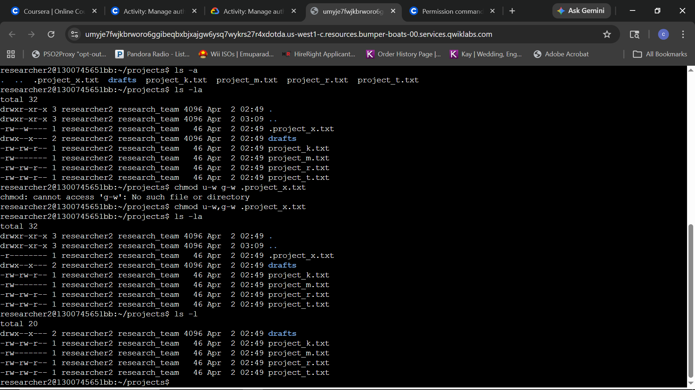
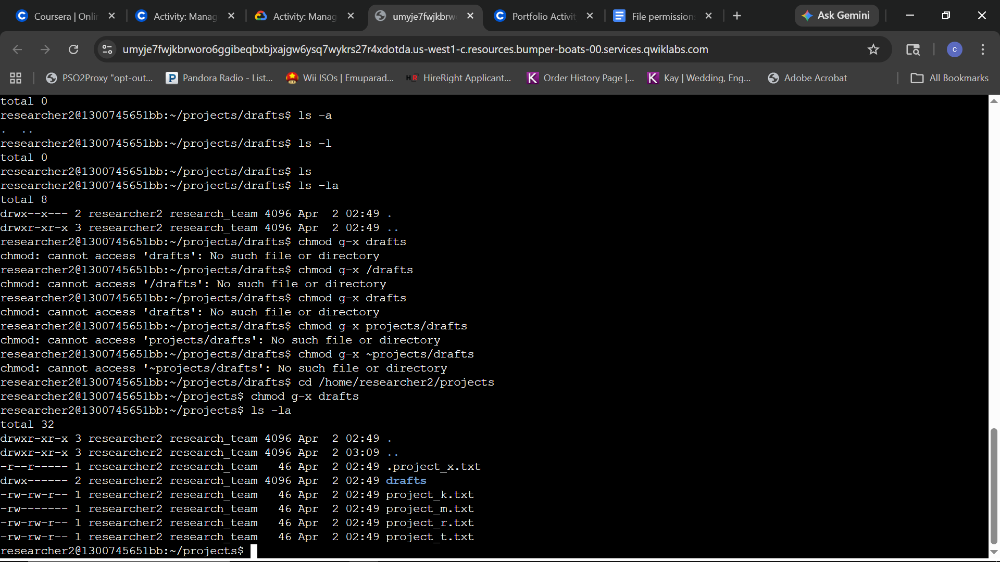

# Lab Report: Manage Authorization

## Scenario
As a security analyst for a research team, I am responsible for auditing and managing file permissions within the `/home/researcher2/projects` directory. The goal is to enforce the **Principle of Least Privilege**, ensuring that sensitive research data is only accessible to authorized users and groups, while explicitly removing unauthorized access for "others."

**Objective:** 
Audit the directory for permission drifts, identify hidden files with insecure configurations, and utilize the `chmod` command to harden the authorization posture of the research environment.

---

### Task 1: Check file and directory details
* **Question:** How do you navigate to the projects directory and list the contents and permissions, including any hidden files?
* **Command:** `ls -la` (Executed as `ls -l` and `ls -a` for comprehensive visibility)
* **Screenshot:** 
* **Explanation:** Conducted a comprehensive audit of the projects directory. The use of the `-a` flag revealed a hidden file, `.project_x.txt`, while the long format (`-l`) identified that `project_k.txt` was globally writable, presenting a security risk.

### Task 2: Change file permissions
* **Question:** How do you change the permissions of the file identified in the previous step so that the owner type of other doesn’t have write permissions?
* **Command:** `chmod o-w project_k.txt`
* **Screenshot:** 
* **Explanation:** Successfully modified the permissions of `project_k.txt` by removing write access for the 'other' user category. This enforces a stricter security posture by ensuring only authorized users and group members can modify the file.

### Task 3: Change file permissions on a hidden file
* **Question:** How do you change the permissions of the file .project_x.txt so that both the user and the group can read, but not write to, the file?
* **Command:** `chmod u-w,g-w .project_x.txt`
* **Screenshot:** 
* **Explanation:** Hardened the security of the hidden archival file `.project_x.txt` by removing write permissions for both the user and the group. Note: An initial attempt using a space instead of a comma in the chmod string resulted in a syntax error, which was corrected to ensure the permissions were successfully committed.

### Task 4: Change directory permissions
* **Question:** How do you remove the execute permission for the group from the drafts directory?
* **Command:** `chmod g-x drafts` (Executed after directory path troubleshooting)
* **Screenshot:** 
* **Explanation:** Successfully restricted access to the `drafts` directory by removing group execute permissions. The process involved significant troubleshooting regarding relative vs. absolute paths; initial attempts failed because the command was issued from within the target directory itself. After returning to the `/projects` parent directory, the command was successfully applied, ensuring only the owner has access to the sensitive draft materials.
