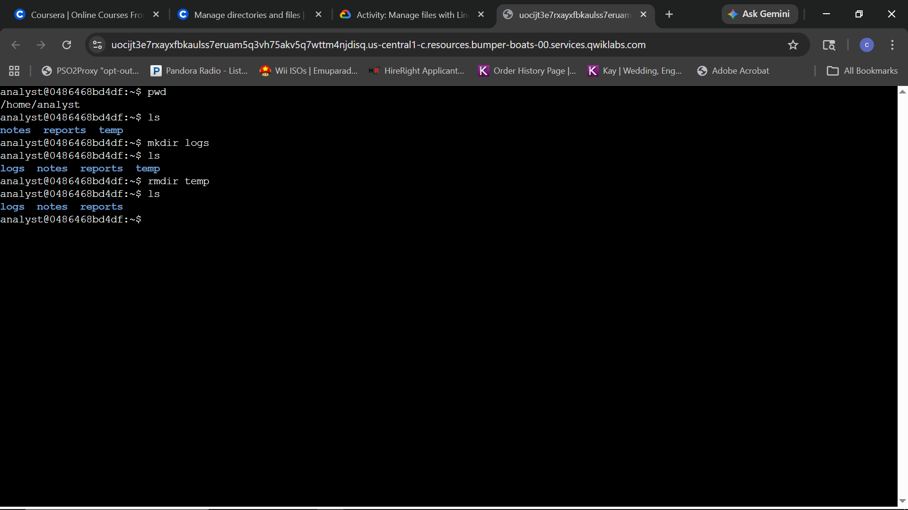
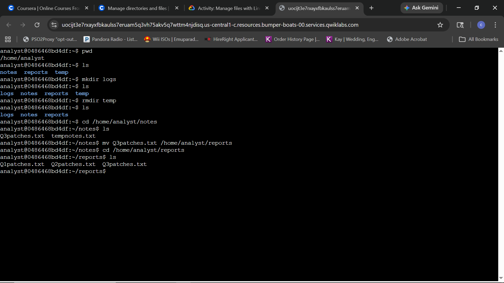
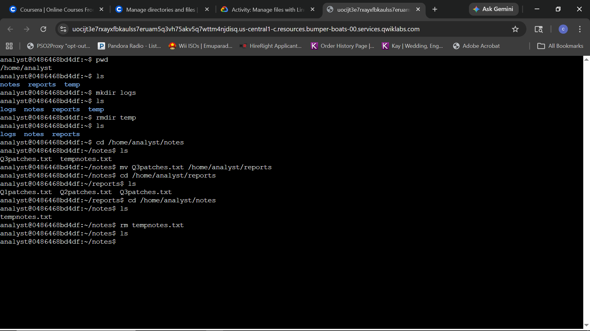
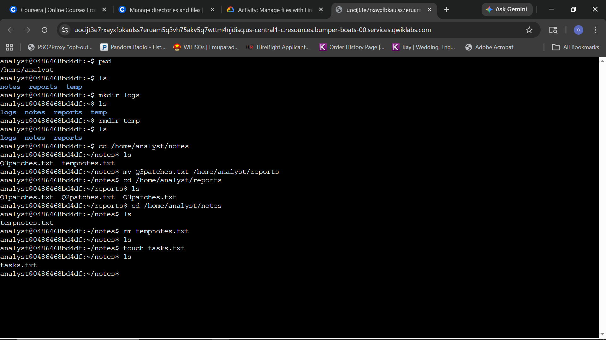
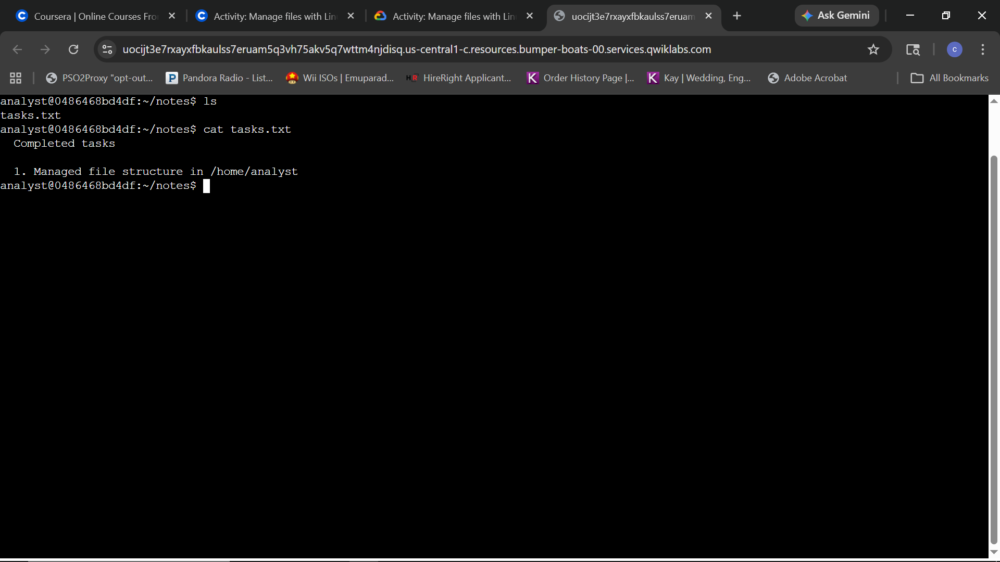

# Lab Report: Manage Files with Linux Commands

## Scenario
As a security analyst, I am tasked with maintaining the integrity and organization of the `/home/analyst` directory. Proper file management is a core competency for ensuring logs are isolated, old data is purged, and reports are correctly categorized for auditing.

**Objective:** 
Reorganize the file structure to support a new logging system, migrate quarterly patch data, and document all administrative actions for technical evidence.

### Current Structure:
- `notes/` (Contains Q3patches.txt, tempnotes.txt)
- `reports/` (Contains Q1patches.txt, Q2patches.txt)
- `temp/` (Flagged for removal)

### Target Structure:
- `logs/` (New directory for system logs)
- `notes/` (Contain updated tasks.txt)
- `reports/` (Consolidated Q1, Q2, and Q3 patch files)

---

### Task 1 & 2: Create and Remove Directories
* **Question:** How do you create a new subdirectory called logs and remove the temp subdirectory in the /home/analyst directory?
* **Commands:** 
    * `mkdir logs`
    * `rmdir temp`
* **Screenshot:** 
* **Explanation:** Successfully provisioned a new `logs` subdirectory for future data ingestion and decommissioned the obsolete `temp` directory to maintain file system hygiene as required by the organization's directory structure update.

### Task 3: Move a file
* **Question:** How do you move the Q3patches.txt file from the notes directory to the reports directory?
* **Command:** `mv Q3patches.txt /home/analyst/reports`
* **Screenshot:** 
* **Explanation:** Relocated the third-quarter patch file to the centralized reports directory for data consolidation.

 ### Task 4: Remove a file
* **Question:** How do you remove the tempnotes.txt file from the /home/analyst/notes directory?
* **Command:** `rm tempnotes.txt`
* **Screenshot:** 
* **Explanation:** Deleted the obsolete temporary notes file to ensure the notes directory contains only relevant, active documentation.

### Task 5: Create a new file
* **Question:** How do you use the touch command to create an empty file called tasks.txt in the /home/analyst/notes directory?
* **Command:** `touch tasks.txt`
* **Screenshot:** 
* **Explanation:** Provisioned a new text file to serve as a log for documenting administrative task completion.

### Task 6: Edit a file
* **Question:** How do you use the nano text editor to edit the tasks.txt file and add a note describing the tasks you’ve completed?
* **Command:** `cat tasks.txt` (to verify edit)
* **Screenshot:** 
* **Explanation:** Successfully used the nano text editor to document completed tasks. The final verification via the `cat` command confirms that the file contents were saved correctly.
