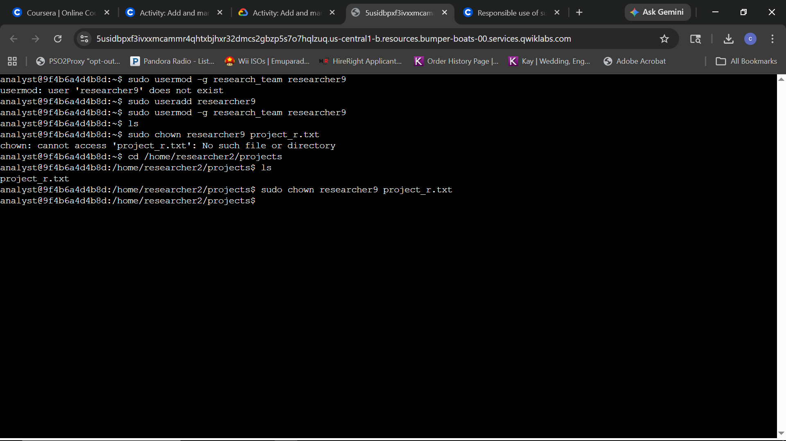
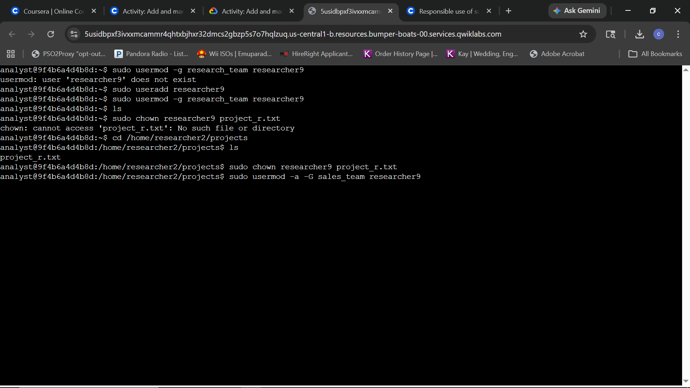
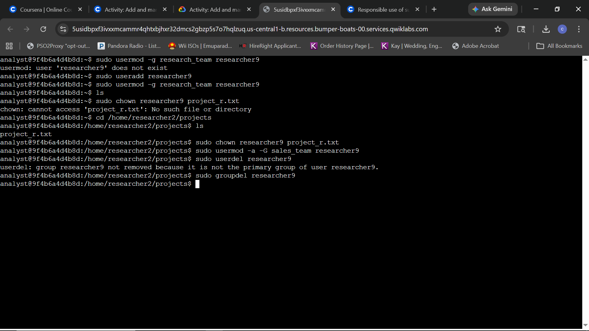

# Lab Report: Add and Manage Users with Linux Commands

## Scenario
In this scenario, a new employee with the username **researcher9** joins an organization. As a security analyst, I am responsible for adding them to the system and managing their access lifecycle. This includes primary group assignment, file ownership transfers, and secondary group memberships, ultimately concluding with secure account decommissioning.

**Objective:** 
Add a new employee to the system and their primary group, transfer ownership of project-specific files, manage supplementary group access, and securely delete the user and their associated groups.

---

## Task 1: Add a new user

**Question 1:** 
Write a command to add a user called `researcher9` to the system.

**Question 2:** 
Use the `usermod` command and `-g` option to add `researcher9` to the `research_team` group as their primary group.

**Evidence:**

**Explanation:**
The terminal evidence shows the end-to-end initialization of the new user. After an initial "user does not exist" error, I used `sudo useradd researcher9` to create the account. Following creation, I used `sudo usermod -g research_team researcher9` to align the user’s primary group with the **Research** department. This ensures that any files created by this user are automatically associated with the correct team by default.

---
## Task 2 & 3: File Ownership and Secondary Group Assignment

**Question 2:** 
Use the `chown` command to make `researcher9` the owner of `/home/researcher2/projects/project_r.txt`.

**Question 3:** 
Use the `usermod` command with the `-a` and `-G` options to add `researcher9` to the `sales_team` group as a secondary group.

**Evidence:**

**Explanation:**
The terminal log captures the successful transfer of file ownership and group expansion, as well as a necessary course correction. An initial attempt to change ownership failed with a "No such file or directory" error because the command was executed before navigating into the project directory. After using `cd /home/researcher2/projects`, I successfully ran `sudo chown researcher9 project_r.txt` to grant the user administrative control over the file. 

Immediately following, I executed `sudo usermod -a -G sales_team researcher9`. The use of the `-a` (append) flag in conjunction with `-G` was critical to ensure `researcher9` was added to the `sales_team` as a secondary group without being purged from their primary `research_team` membership, effectively managing cross-departmental access.

---
## Task 4: Delete a user

**Question:** 
A year later, researcher9 decided to leave the company. Run a command to delete researcher9 from the system and then delete the researcher9 group that is no longer required.

**Evidence:**

**Explanation:**
To offboard the employee, I executed `sudo userdel researcher9`. The system returned a notification stating the group `researcher9` was not removed because it was no longer the user's primary group (which I had previously changed to `research_team`). This is expected behavior. To maintain a clean system state and prevent "orphan" groups, I manually executed `sudo groupdel researcher9` to finalize the removal of all entities associated with the former employee.

---

