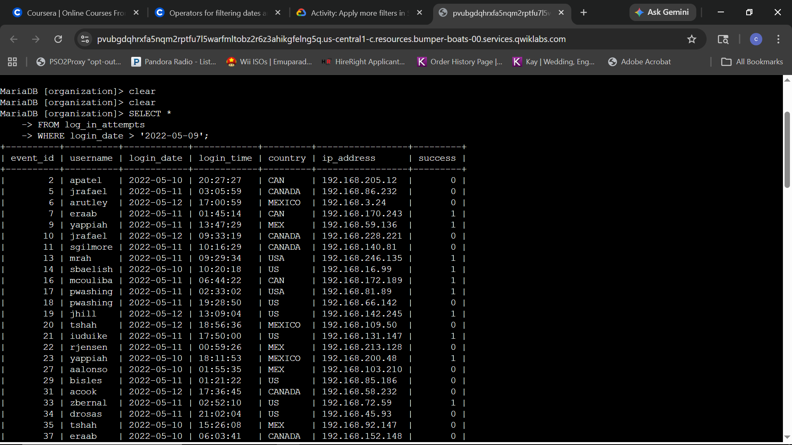
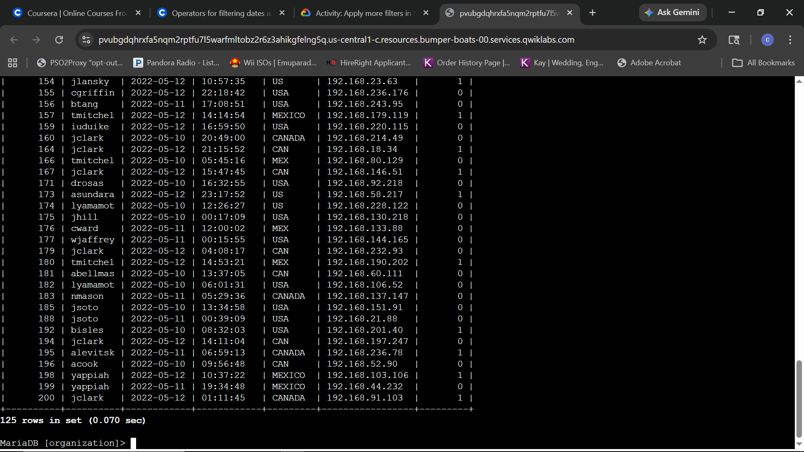
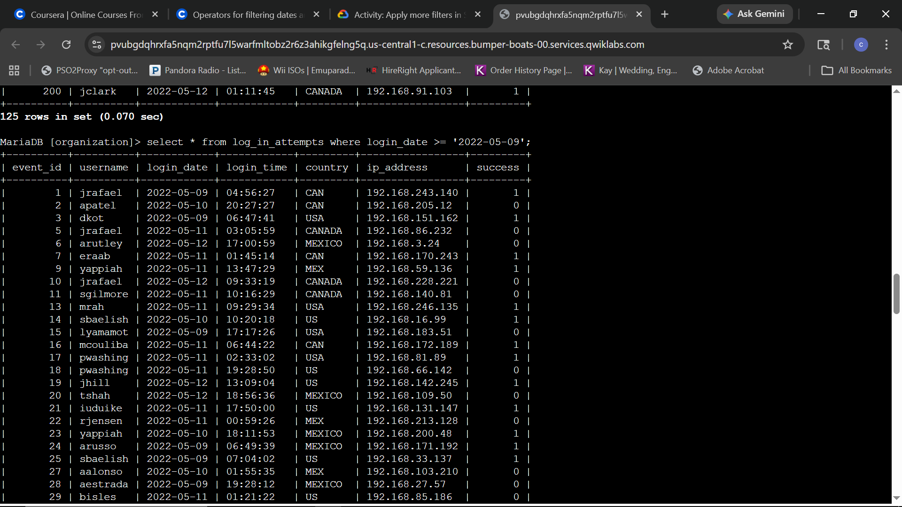
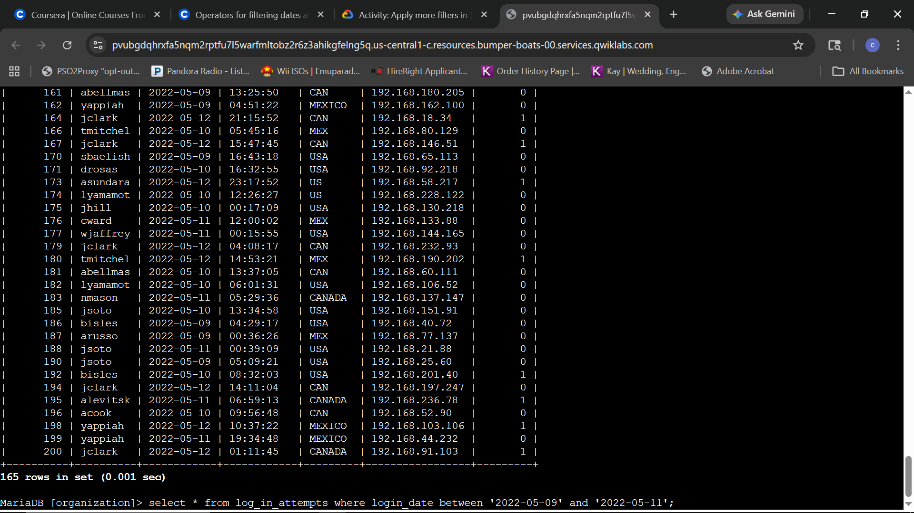

# Lab Report: Create more advanced SQL filters

## Scenario
**Objective:** As a security practitioner, the objective is to investigate a recent security incident by utilizing advanced SQL filtering techniques. This involves gathering specific telemetry regarding login attempts across defined date ranges, specific times, and unique event identifiers to resolve the incident.

---

### Task 1: Retrieve login attempts after a certain date
The objective is to isolate authentication events occurring after a known incident start point of May 9th, 2022, to begin building a forensic timeline.

**Queries:**
```sql
SELECT * FROM log_in_attempts WHERE login_date > '2022-05-09';
SELECT * FROM log_in_attempts WHERE login_date >= '2022-05-09';
```

****
*Initial forensic audit: Isolating all login attempts occurring exclusively after 2022-05-09.*

****
*Result verification: Successful retrieval of 125 records for the initial post-incident window.*

****
*Expanded audit: Adjusting the operator to include authentication events that occurred on the incident start date.*

****
*Inclusive verification: Successful retrieval of 165 records, identifying 40 additional high-risk events for investigation.*

**Technical Analysis:**
The transition from the greater-than operator (`>`) to the greater-than-or-equal-to operator (`>=`) demonstrates the iterative nature of forensic discovery. While the initial query provided a clear view of activity following the incident, expanding the search to include the specific start date ensured that no transitionary login attempts were missed. This level of precision is critical when establishing the exact moment of compromise during a security investigation.

---

