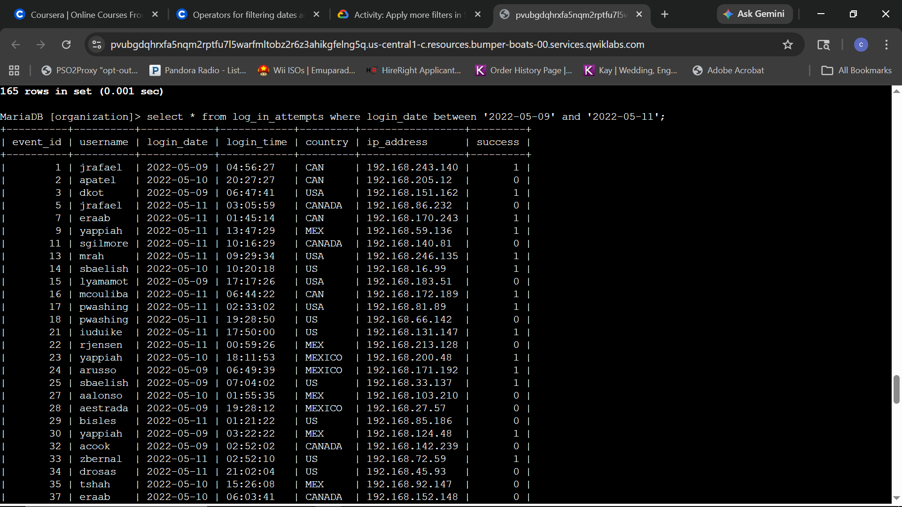
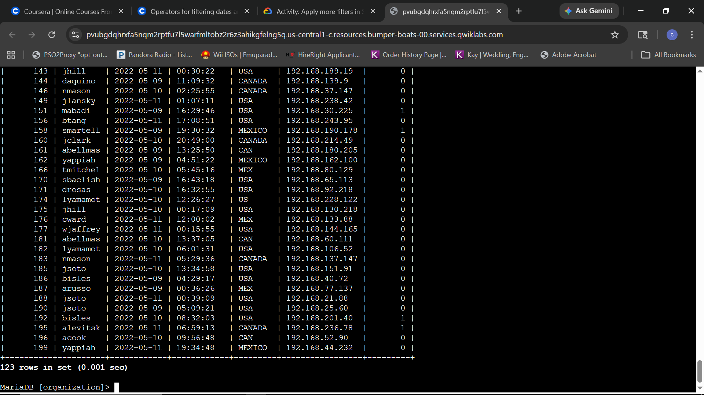
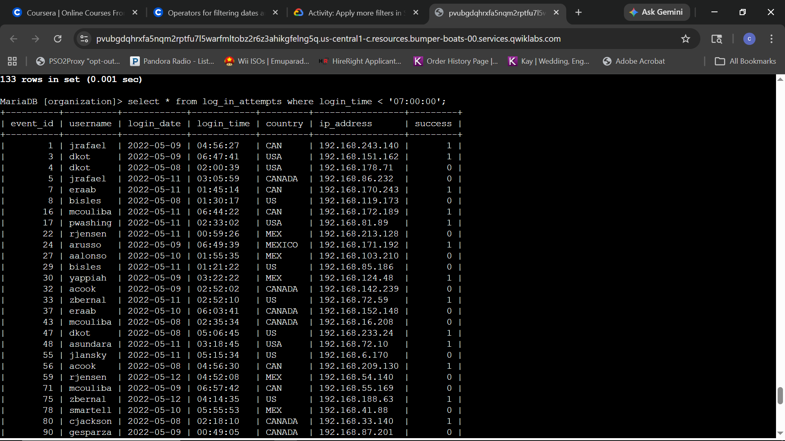
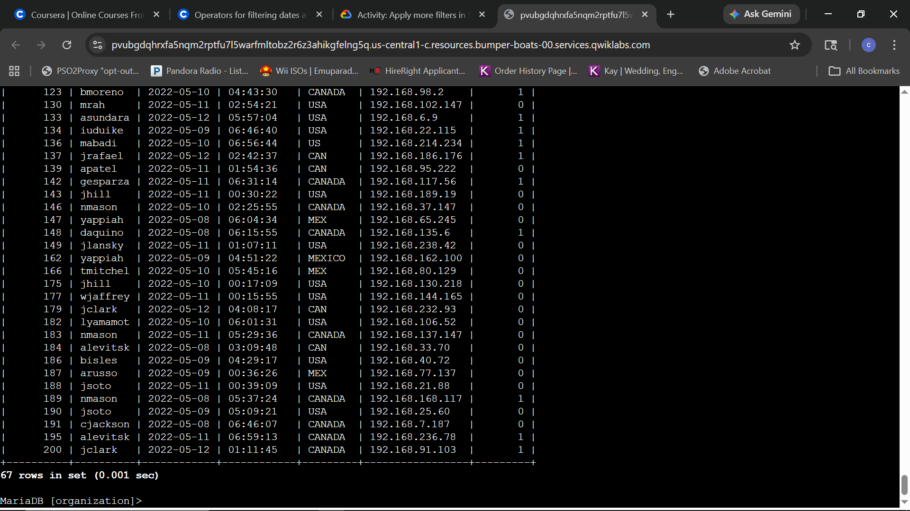
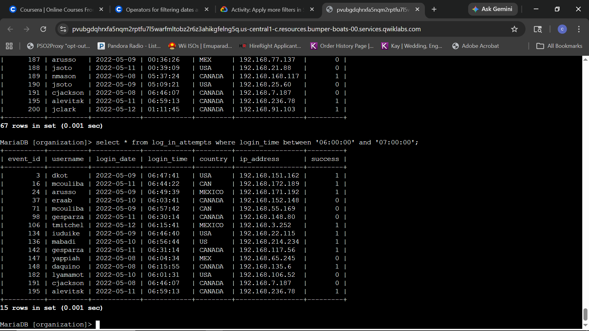
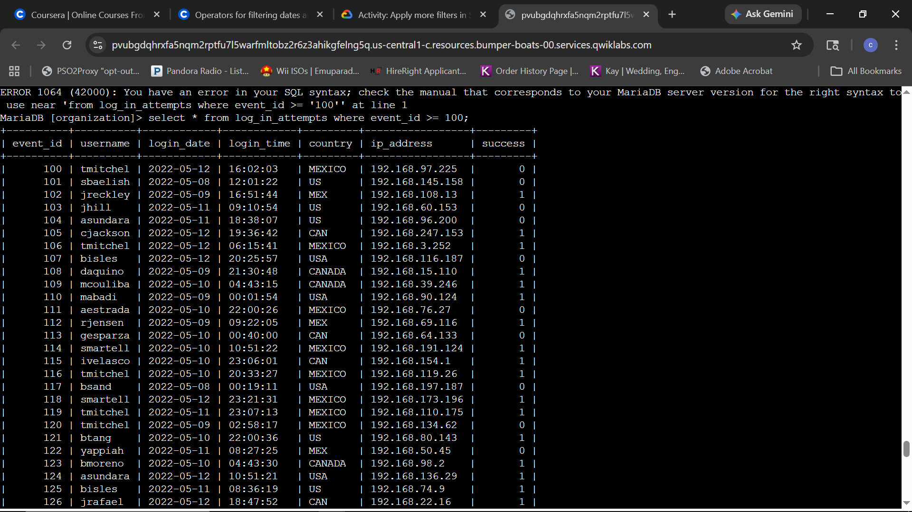
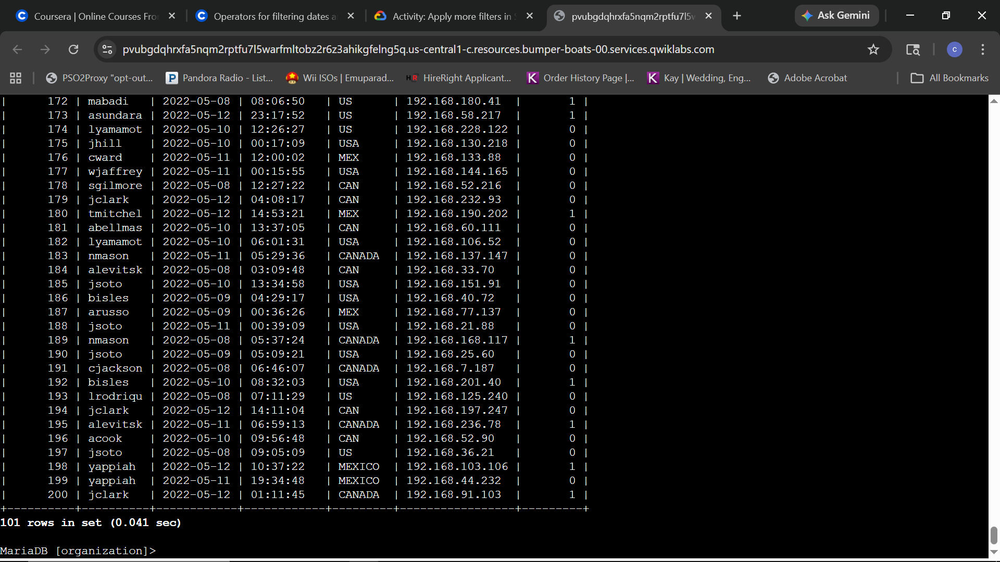
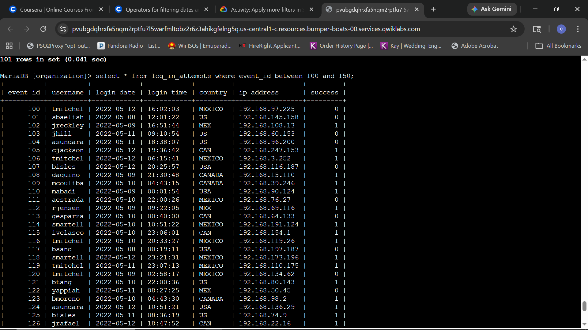
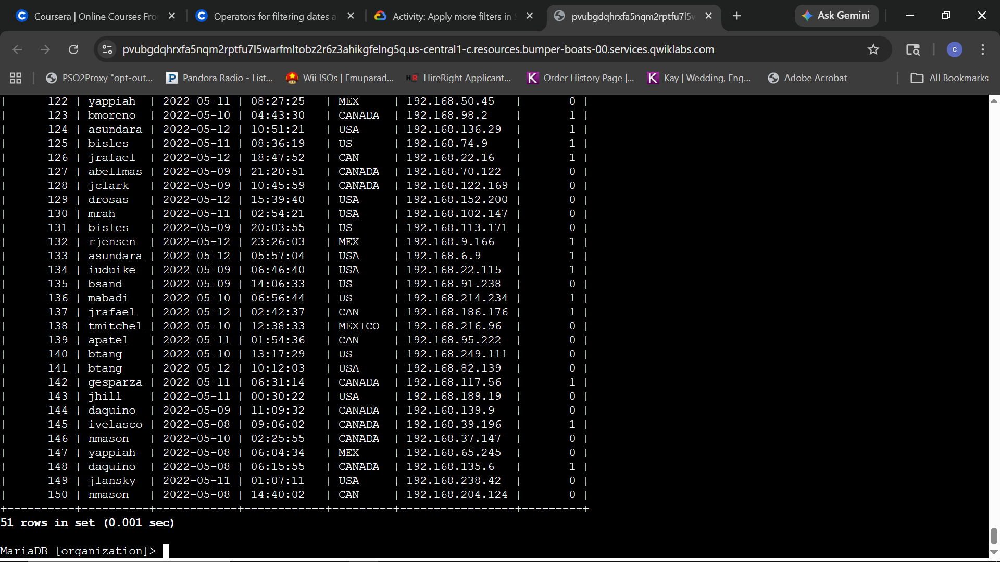

# Lab Report: Create more advanced SQL filters

## Scenario
**Objective:** As a security practitioner, the objective is to investigate a recent security incident by utilizing advanced SQL filtering techniques. This involves gathering specific telemetry regarding login attempts across defined date ranges, specific times, and unique event identifiers to resolve the incident.

---

### Task 1: Retrieve login attempts after a certain date
The objective is to isolate authentication events occurring after a known incident start point of May 9th, 2022, to begin building a forensic timeline.

**Queries:**
```sql
SELECT * FROM log_in_attempts WHERE login_date > '2022-05-09';
SELECT * FROM log_in_attempts WHERE login_date >= '2022-05-09';
```

****
*Initial forensic audit: Isolating all login attempts occurring exclusively after 2022-05-09.*

****
*Result verification: Successful retrieval of 125 records for the initial post-incident window.*

****
*Expanded audit: Adjusting the operator to include authentication events that occurred on the incident start date.*

****
*Inclusive verification: Successful retrieval of 165 records, identifying 40 additional high-risk events for investigation.*

**Technical Analysis:**
The transition from the greater-than operator (`>`) to the greater-than-or-equal-to operator (`>=`) demonstrates the iterative nature of forensic discovery. While the initial query provided a clear view of activity following the incident, expanding the search to include the specific start date ensured that no transitionary login attempts were missed. This level of precision is critical when establishing the exact moment of compromise during a security investigation.

---

### Task 2: Retrieve logins in a date range
The objective is to narrow the focus of the investigation by excluding activity after 2022-05-11. Using the `BETWEEN` and `AND` operators allows for the retrieval of all telemetry within a specific 72-hour window.

**Query:**
```sql
SELECT * FROM log_in_attempts WHERE login_date BETWEEN '2022-05-09' AND '2022-05-11';
```

****
*Initial range audit: Utilizing the `BETWEEN` and `AND` operators to isolate all authentication events within the critical 72-hour window of May 9th to May 11th.*

****
*Result verification: Confirmed retrieval of 123 records, successfully filtering the dataset to include only the specified three-day investigative window.*

**Technical Analysis:**
By implementing the `BETWEEN` and `AND` operators, the search was effectively constrained to a high-fidelity window. This inclusive range ('2022-05-09' to '2022-05-11') allows for a consolidated view of activity, eliminating the noise of subsequent, unrelated logins. For a security practitioner, this precision is vital for correlating events across multiple systems during a specific breach duration.

---

### Task 3: Investigate logins at certain times
To investigate potential unauthorized access outside of standard operational hours, an audit was conducted on login attempts occurring before the organization's 07:00:00 start time.

**Queries:**
```sql
SELECT * FROM log_in_attempts WHERE login_time < '07:00:00';
SELECT * FROM log_in_attempts WHERE login_time BETWEEN '06:00:00' AND '07:00:00';
```

****
*Out-of-hours audit: Implementing the `<` operator to isolate 133 authentication events occurring before the 07:00:00 threshold.*

****
*Result verification: Successful retrieval of 133 total records for the pre-07:00:00 audit, providing clear visibility into early-morning system access.*

****
*Refined temporal audit: Utilizing the `BETWEEN` and `AND` operators to filter logins occurring specifically between 06:00:00 and 07:00:00, resulting in 15 targeted records.*

**Technical Analysis:**
Filtering by `login_time` allows for the identification of behavioral anomalies. By first isolating all activity before standard business hours, a broad overview of early-access patterns was established. Narrowing this search using the `BETWEEN` operator to the 06:00:00 to 07:00:00 window further refined the investigation, allowing for a concentrated review of the 15 login attempts immediately preceding the start of the workday. This is essential for detecting "low and slow" reconnaissance or unauthorized automated tasks.

---

### Task 4: Investigate logins by event ID
To facilitate a structured forensic review, login attempts were filtered based on their unique event identifiers. This method allows for systematic analysis of specific telemetry blocks.

**Queries:**
```sql
SELECT event_id, username, login_date FROM log_in_attempts WHERE event_id >= 100;
SELECT event_id, username, login_date FROM log_in_attempts WHERE event_id BETWEEN 100 AND 150;
```

****
*ID-based audit: Implementing the `>=` operator to filter for authentication events with an `event_id` of 100 or greater, establishing a baseline for high-index event investigation.*

****
*Result verification: Successful retrieval of 101 records (IDs 100 through 200), completing the high-index event audit.*

****
*Refined ID audit: Applying the `BETWEEN` and `AND` operators to filter for a specific subset of event identifiers (100 to 150), allowing for targeted forensic analysis of mid-range login attempts.*

****
*Result verification: Successful retrieval of 51 records, confirming the accurate filtering of event identifiers within the specific 100 to 150 range.*

**Technical Analysis:**
Filtering by `event_id` provides a structured method for isolating specific log entries without relying on potentially volatile temporal data. The initial broad filter (>= 100) identified a large block of recent activity, while the subsequent range filter (100-150) allowed for the isolation of a manageable subset of 51 records. In a security operations context, this allows an analyst to systematically work through telemetry in "blocks," ensuring comprehensive coverage during a forensic deep dive.


