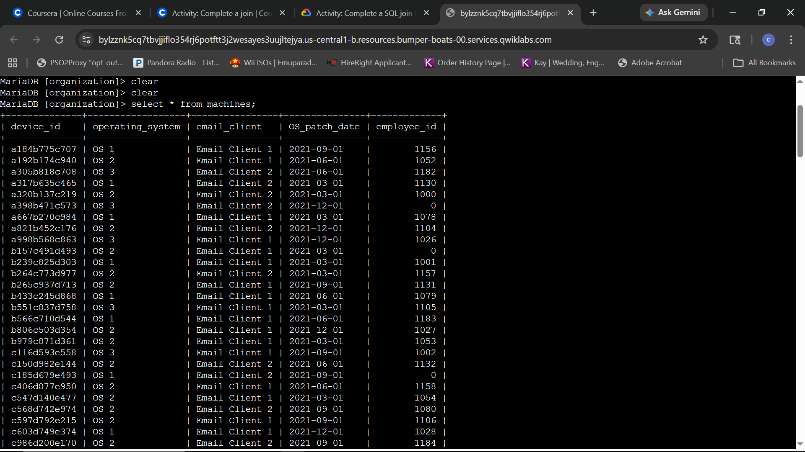
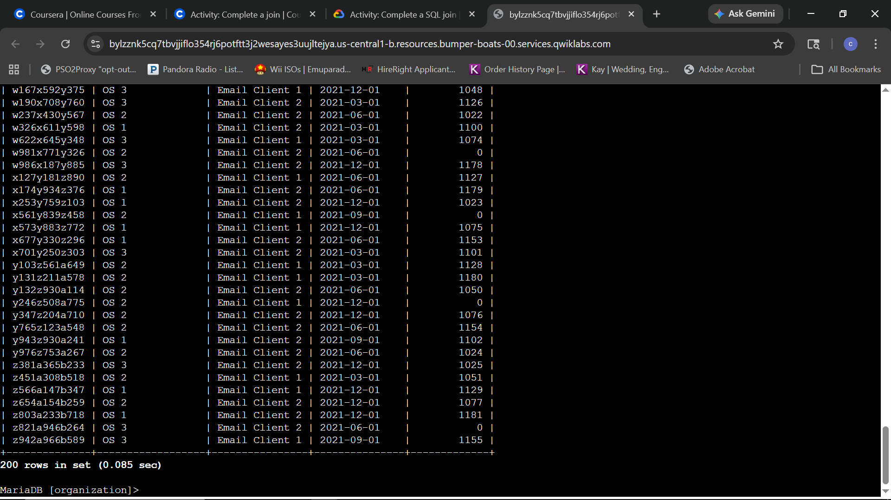
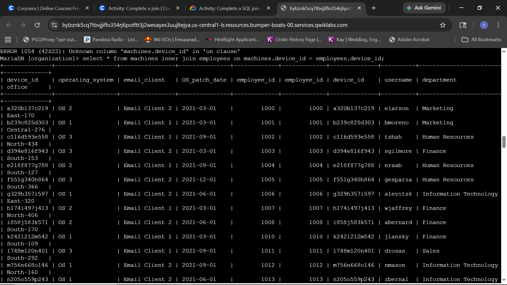
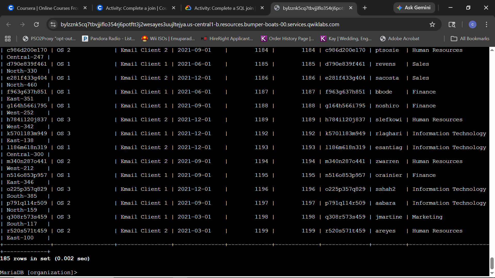
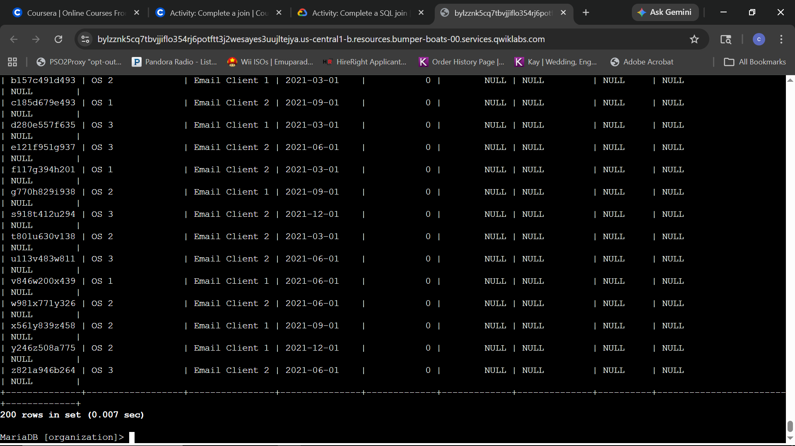
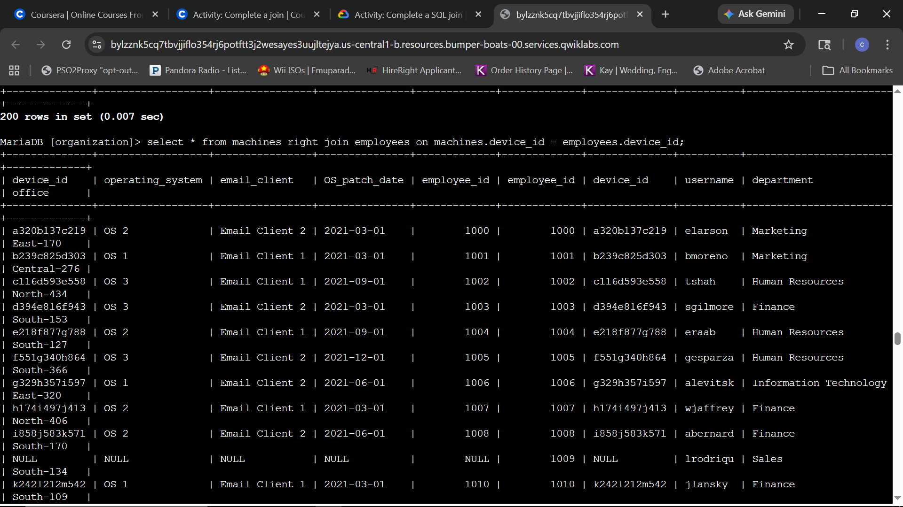
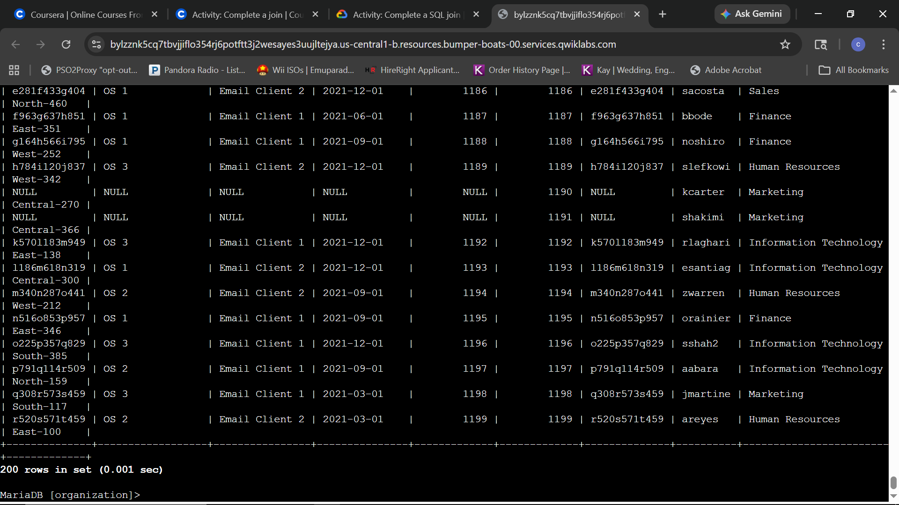
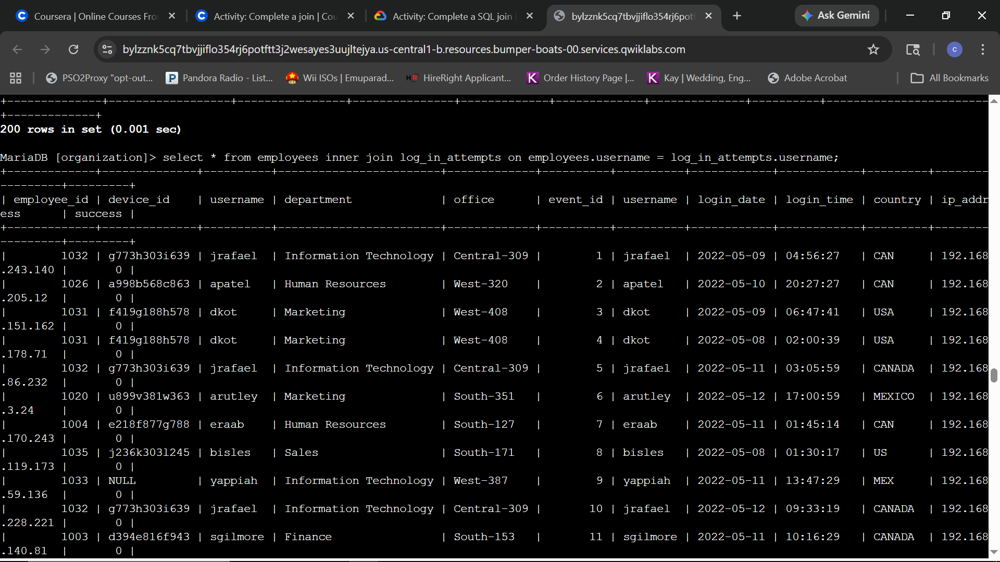
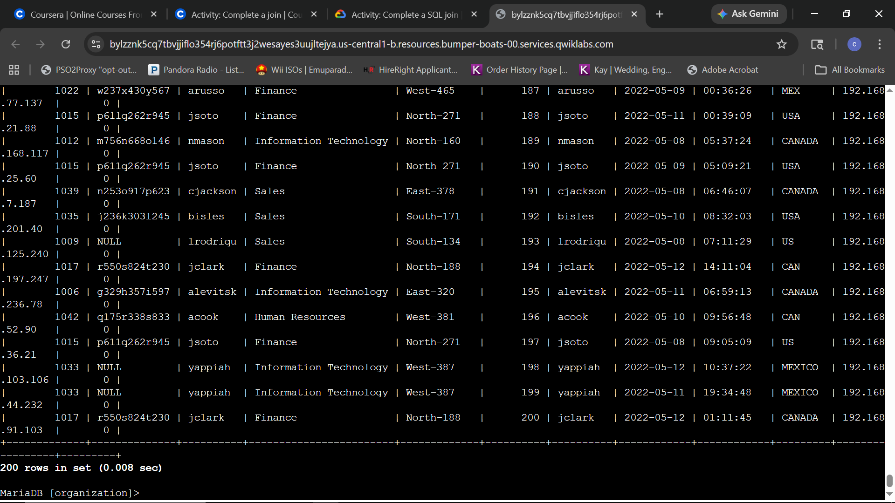

# Lab Report: Join SQL Queries

## Scenario
**Objective:** Investigate a recent security incident that compromised some machines. You are responsible for getting the required information from the database for the investigation. First, you’ll use an inner join to identify which employees are using which machines. Second, you’ll use left and right joins to find machines that do not belong to any specific user and users who do not have any specific machine assigned to them. Finally, you’ll use an inner join to list all login attempts made by all employees.

---

### Task 1: Match employees to their machines
First, you must identify which employees are using which machines. The data is located in the machines and employees tables. You must use a SQL inner join to return the records you need based on a connecting column. Both tables include the device_id column, which you’ll use to perform the join.

**Query:**
```sql
SELECT * FROM machines;
```

****
*Initial baseline audit: Retrieving all assets from the machines table to inspect inventory columns, operating system configurations, and patch timelines.*

****
*Asset Inventory Analysis: Reviewing the remaining rows of the 200-row inventory dataset to identify null or unassigned machine identifiers.*

**Query:**
```sql
SELECT * FROM machines INNER JOIN employees ON machines.device_id = employees.device_id;
```

****
*Identity Mapping: Executing an inner join to explicitly correlate hardware assets with verified employee accounts based on matching device identifiers.*

****
*Identity Mapping Verification: Reviewing the final rows of the inner join result, showing a total of 185 rows successfully matched between the assets and employee records.*

**Technical Analysis:**
By leveraging the `INNER JOIN` operator on the common `device_id` primary/foreign key relationship, the query eliminates unassigned inventory gaps and maps assets directly to personnel. The resulting 185-row dataset serves as an authoritative identity-to-asset mapping baseline. In a live forensic investigation, this strict intersection allows a defender to immediately connect a compromised machine's hardware profile to a specific employee identity and department, eliminating guesswork during an incident triage.

---

### Task 2: Return more data
You now must return the information on all machines and the employees who have machines. Next, you must do the reverse and retrieve the information of all employees and any machines that are assigned to them. To achieve this, you’ll complete a left join and a right join on the employees and machines tables. The results will include all records from one or the other table. You must link these tables using the common device_id column.

**Query:**
```sql
SELECT * FROM machines LEFT JOIN employees ON machines.device_id = employees.device_id;
```

****
*Asset-Centric Mapping: Executing a left join to prioritize all hardware records from the machines table while pulling matching employee data where available.*

****
*Unassigned Asset Identification: Analyzing the final rows of the left join output to uncover unassigned physical machines, highlighted by NULL values across employee data fields.*

**Query:**
```sql
SELECT * FROM machines RIGHT JOIN employees ON machines.device_id = employees.device_id;
```

****
*User-Centric Mapping: Executing a right join to prioritize all user identities from the employees table while gathering associated machine hardware profiles.*

****
*Unassigned User Identification: Analyzing the final rows of the right join output to detect employees without assigned corporate hardware, marked by NULL database entries.*

**Technical Analysis:**
Utilizing `LEFT JOIN` and `RIGHT JOIN` allows an analyst to identify structural gaps in the asset inventory that an `INNER JOIN` inherently conceals. The `LEFT JOIN` focuses on the `machines` table, mapping out all 200 hardware nodes and explicitly identifying rogue or unassigned assets containing `NULL` owner records. Conversely, the `RIGHT JOIN` highlights the `employees` table, exposing personnel like `lrodrigu` (employee 1009) who lack assigned equipment. From an incident response posture, pinpointing these unassigned elements isolates potential shadow IT devices or active accounts lacking authorized hardware baselines.

---

### Task 3: Retrieve login attempt data
To continue investigating the security incident, you must retrieve the information on all employees who have made login attempts. To achieve this, you’ll perform an inner join on the employees and log_in_attempts tables, linking them on the common username column.

**Query:**
```sql
SELECT * FROM employees INNER JOIN log_in_attempts ON employees.username = log_in_attempts.username;
```

****
*Authentication Correlation: Executing an inner join between employee accounts and authentication events to explicitly tie specific login parameters back to departmental roles.*

****
*Authentication Audit Finalization: Reviewing the final records of the 200-row authentication dataset to identify correlations between employee identities and high-indexed event entries.*

**Technical Analysis:**
By combining corporate directory data with real-time log telemetry via an `INNER JOIN` on the `username` field, the resulting dataset maps individual authentication parameters directly to personal corporate profiles. Correlating attributes like `ip_address`, `country`, and authentication `success` flags against verified employee departments enables rapid threat tracking. During a compromise analysis, this structural link allows analysts to quickly pinpoint anomalous login geographic coordinates or network subnets used by internal department personnel.
