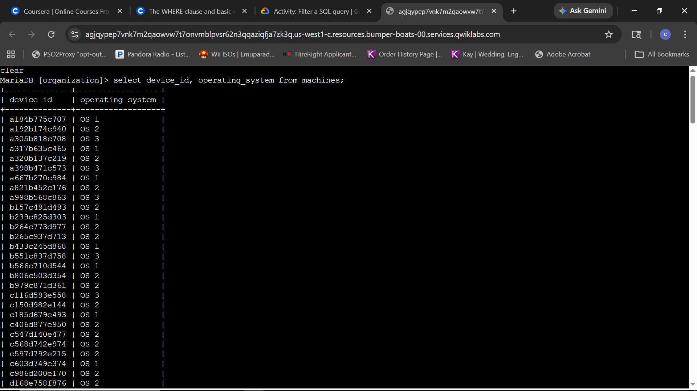
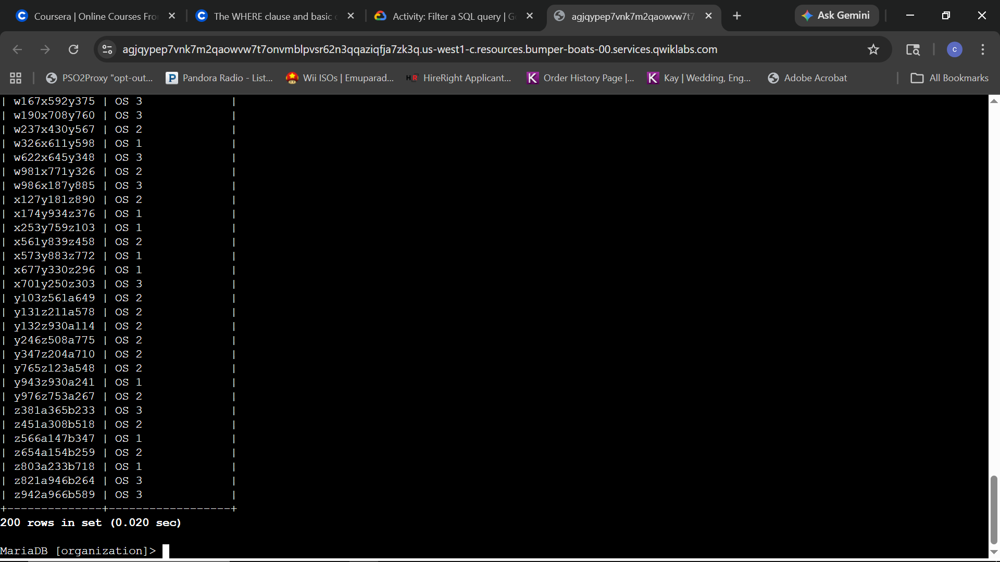
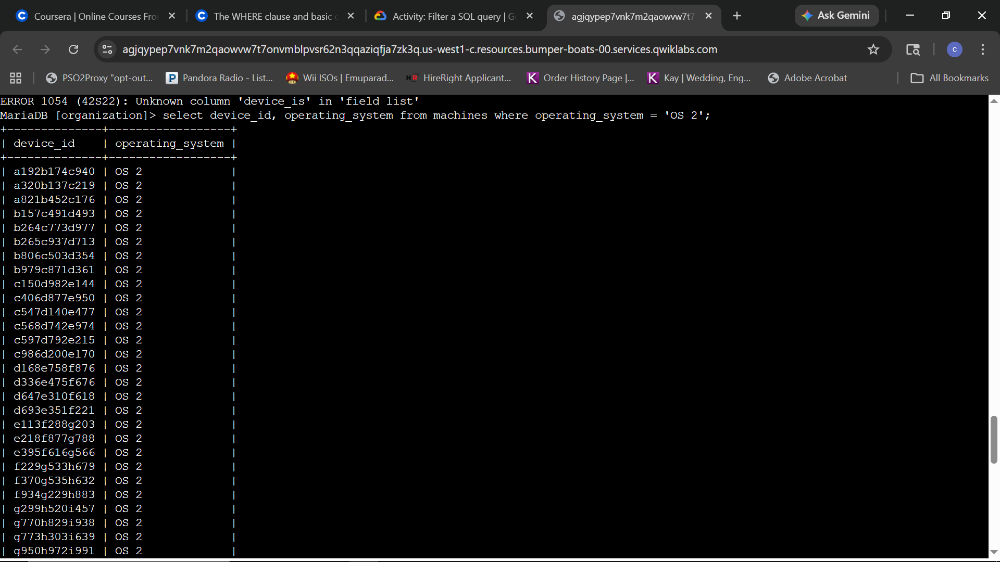
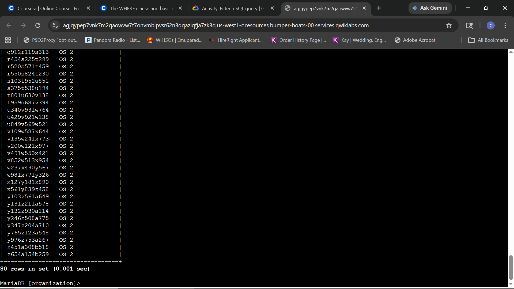
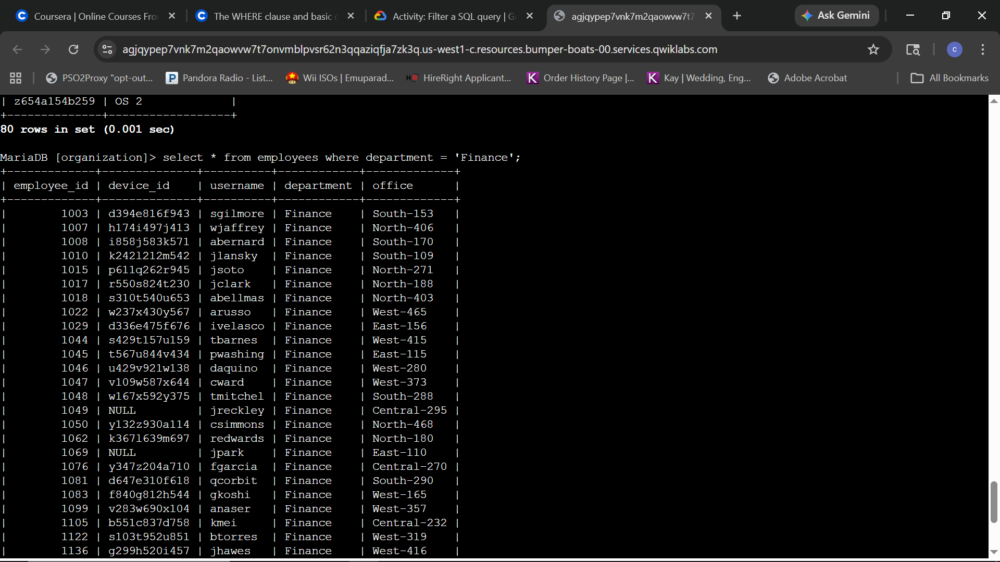
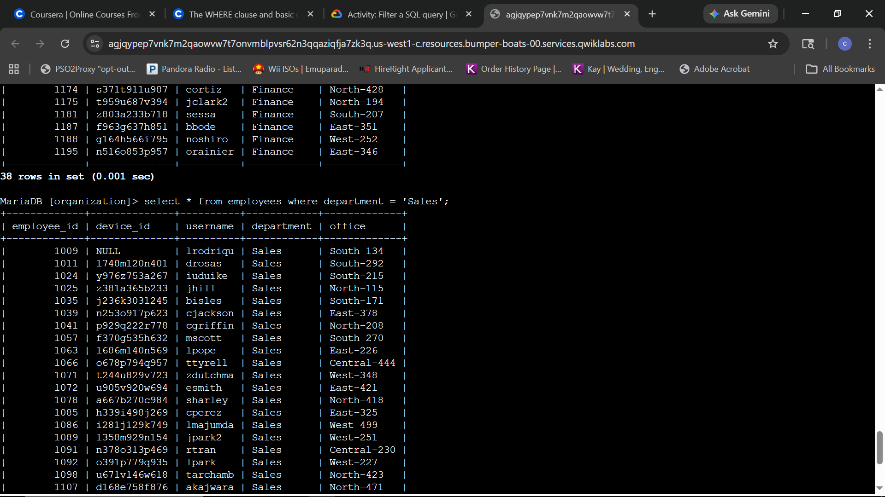
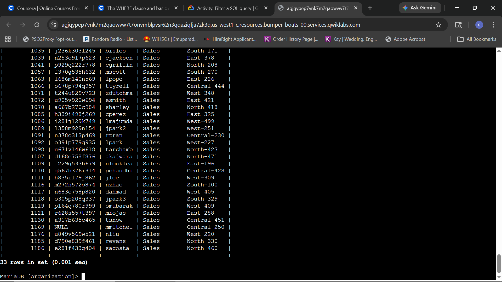
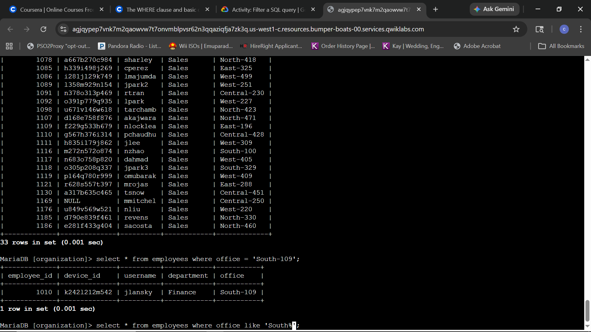
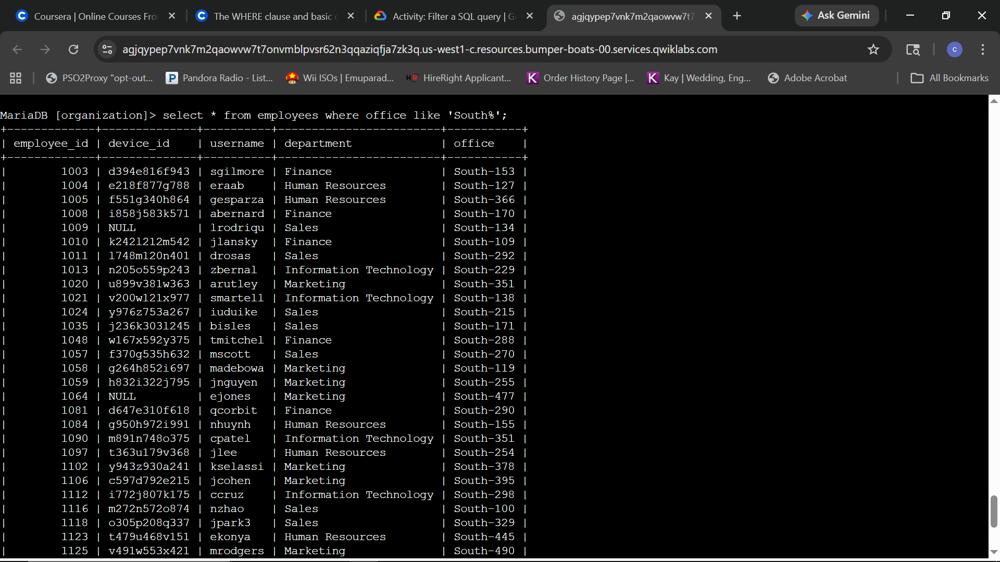
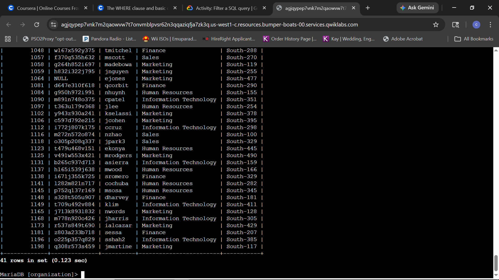

# Lab Report: Apply Filters to SQL Queries

## Scenario
**Objective:** As a security practitioner, the objective is to use SQL filtering techniques to retrieve specific organizational data regarding employee machines and departmental assignments to facilitate targeted system updates and security notifications.

---

### Task 1: List all organization machines
The objective is to generate a comprehensive list of all organizational devices and their respective operating systems to establish a baseline for update requirements.

**Query:**
```sql
SELECT device_id, operating_system FROM machines;
```

****
*Asset inventory: Isolating device identifiers and operating system versions from the machines table.*

****
*Inventory verification: Successful retrieval of 200 records for organizational asset mapping.*

**Technical Analysis:**
By selecting only `device_id` and `operating_system`, I have successfully minimized data clutter and focused strictly on the attributes required for system auditing. This targeted approach is more efficient than a wildcard query and provides a clear map of the OS distribution across the network, which is critical for identifying which systems are susceptible to OS-specific vulnerabilities.

---

### Task 2: Retrieve a list of the machines with OS 2
The objective is to isolate all devices running the 'OS 2' operating system to identify targets for an upcoming security patch or system update.

**Query:**
```sql
SELECT device_id, operating_system FROM machines WHERE operating_system = 'OS 2';
```

****
*Targeted filtering: Using the WHERE clause to isolate devices running 'OS 2'.*

****
*Audit verification: Successful extraction of 80 specific records requiring updates.*

**Technical Analysis:**
The implementation of the `WHERE` clause allowed for a precise extraction of records based on a specific criteria—in this case, the operating system version. From a security management perspective, this filtering capability is vital for rapid response. Instead of manually parsing 200 records, the query immediately identified the 80 high-priority devices requiring attention, significantly reducing the time to remediation.

---

### Task 3: List employees in specific departments
The objective is to identify all employees within the Finance and Sales departments. This data is required to distribute specialized security notices regarding the handling of confidential information.

**Queries:**
```sql
SELECT * FROM employees WHERE department = 'Finance';
SELECT * FROM employees WHERE department = 'Sales';
```

****
*Departmental audit: Extracting the initial roster of personnel assigned to the Finance department.*

****
*Query transition: Verifying the conclusion of the Finance audit (38 records) and the initiation of the Sales department filter.*

****
*Audit verification: Successful extraction of 33 records for the Sales department.*

**Technical Analysis:**
Utilizing specific string filters within the `WHERE` clause allows for the segmentation of the workforce by organizational role. From a compliance perspective, this ensures that security training and policy updates—such as those regarding PII or financial data—reach the correct audiences without over-distributing sensitive instructions to departments where they are not applicable.

---

### Task 4: Identify employee machines
The objective is to identify specific personnel impacted by hardware issues in the South building. This requires both precise office-level filtering and broader building-wide pattern matching.

**Queries:**
```sql
SELECT * FROM employees WHERE office = 'South-109';
SELECT * FROM employees WHERE office LIKE 'South%';
```

****
*Incident response: Isolating the specific employee located in office 'South-109' for an immediate hardware alert.*

****
*Pattern matching: Utilizing the LIKE operator with the '%' wildcard to identify all personnel within the South building.*

****
*Audit verification: Successful extraction of 41 records for building-wide notification.*

**Technical Analysis:**
The transition from exact string matching (`=`) to pattern matching (`LIKE`) demonstrates the flexibility required for incident response. While the exact filter was necessary for an individual alert, the wildcard operator allowed for a rapid, building-wide audit once the scope of the issue expanded. This technique is essential for security analysts when searching for indicators of compromise across varied naming conventions or identifying all assets within a specific network segment or physical location.

---

