### Task 1: Retrieve employee device data

#### 1.1: Full Asset Discovery
Establishing a baseline of all system assets within the `machines` table is necessary to facilitate a comprehensive patch management review.

**Query:**
```sql
SELECT * FROM machines;
```

**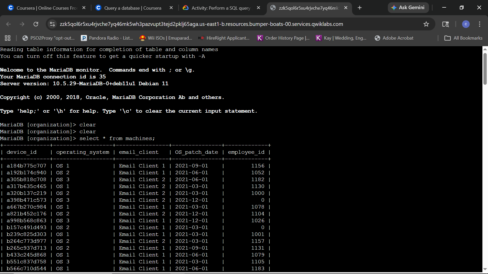**
*Baseline discovery: Verifying table schema and initial records.*

**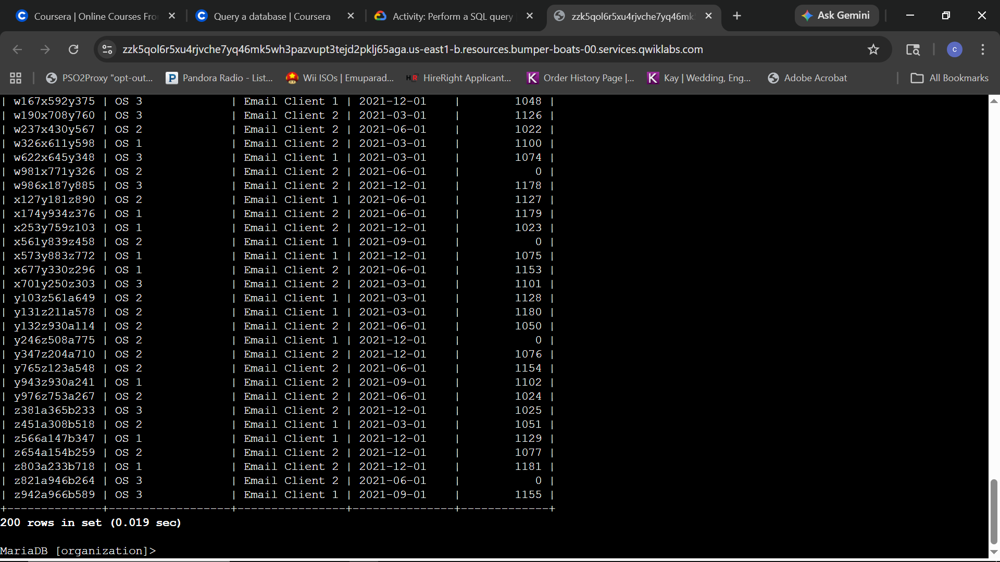**
*Result verification: 200 total records retrieved for the audit.*

**Technical Analysis:**
Executed the initial `SELECT *` query to perform the **Data Discovery** phase of the audit. Identifying columns like `employee_id` (PII) versus `OS_patch_date` (System State) is critical before performing targeted remediation. This ensures the environment's structure is understood before isolating specific risk factors.

---

#### 1.2: Targeted Application Audit
Refining the focus to specific application data allows for an audit of the email clients running across various organizational devices.

**Query:**
```sql
SELECT device_id, email_client FROM machines;
```

**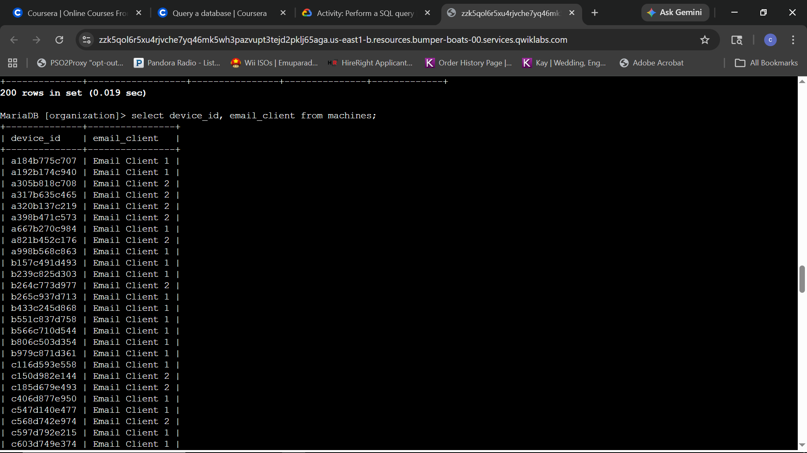**
*Targeted retrieval: Isolating device identifiers and associated email clients.*

**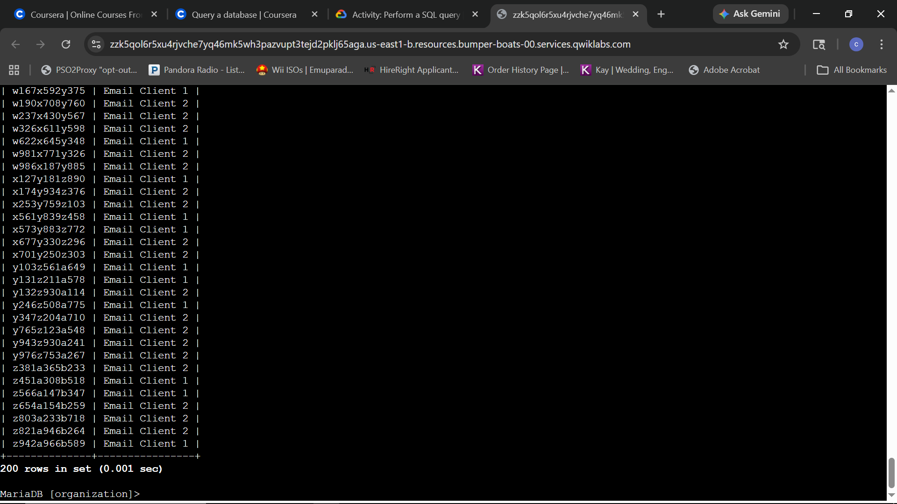**
*Audit verification: Successful extraction of application metadata for all 200 records.*

**Technical Analysis:**
Selecting only `device_id` and `email_client` is a practical application of the **Principle of Least Privilege (PoLP)**. Excluding unnecessary columns like `employee_id` reduces the risk of accidental PII exposure while focusing strictly on application-layer auditing. This precision improves query performance and data clarity.

---

#### 1.3: Patch Management Audit
The final objective for this table is to extract system state information to identify which devices require critical operating system updates.

**Query:**
```sql
SELECT device_id, operating_system, OS_patch_date FROM machines;
```

**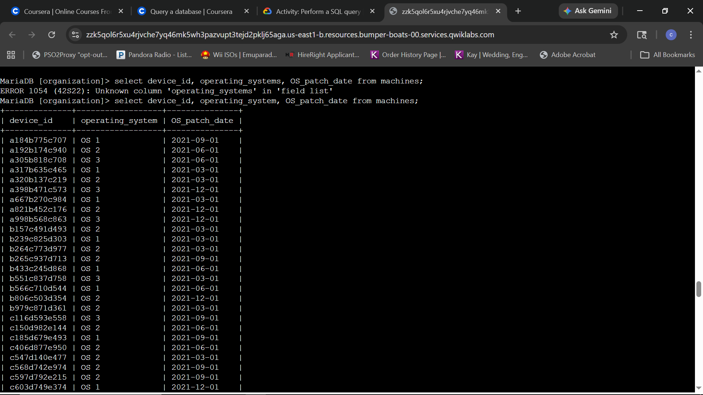**
*System audit: Extracting OS versions and last known patch dates.*

**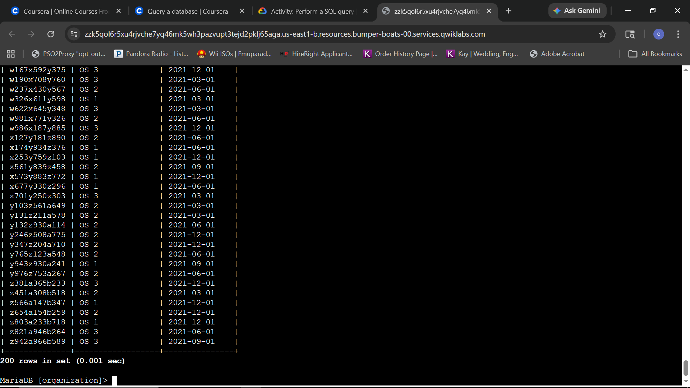**
*Audit verification: Comprehensive list of all 200 devices and their current update status.*

**Technical Analysis:**
Filtering for `device_id`, `operating_system`, and `OS_patch_date` provides the exact telemetry required for high-priority patch management. Identifying systems with older patch dates allows for targeted vulnerability remediation. During this process, a syntax error was encountered due to an incorrect column name; verifying the schema via the initial `SELECT *` query allowed for rapid correction and successful data retrieval.

---

### Task 2: Investigate login activity

#### 2.1: Geolocation Audit
The objective is to investigate the geographical origin of login attempts to ensure they align with the organization's expected operating regions (United States, Canada, and Mexico).

**Query:**
```sql
SELECT event_id, country FROM log_in_attempts;
```

**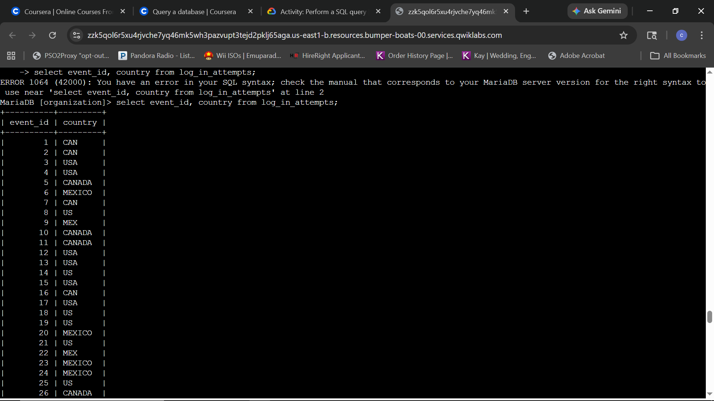**
*Location audit: Retrieving event identifiers and country data for geographical verification.*

**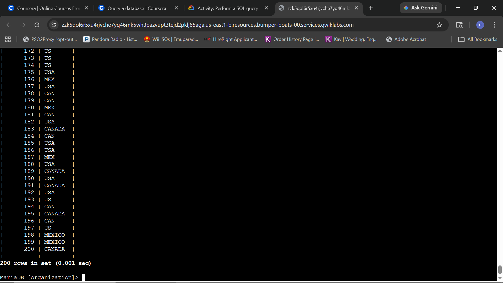**
*Audit verification: Successful extraction of location data for all 200 recorded login attempts.*

**Technical Analysis:**
Isolating `event_id` and `country` allows for an efficient review of access patterns to detect unauthorized geographical anomalies. Monitoring for logins from unexpected regions is a key indicator of potential account compromise. The resolution of an initial syntax error during this task underscores the need for strict adherence to MariaDB syntax protocols when extracting forensic log data.

---

#### 2.2: Temporal Login Analysis
The objective is to audit user authentication timestamps to identify login attempts that occur outside of standard organizational working hours.

**Query:**
```sql
SELECT username, login_date, login_time FROM log_in_attempts;
```

**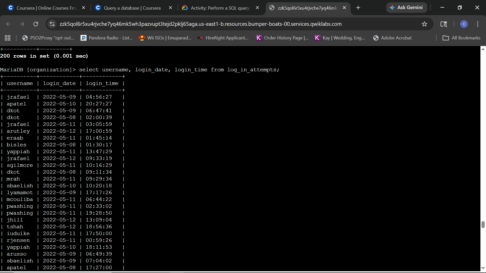**
*Temporal audit: Extracting usernames and specific timestamps for authentication events.*

**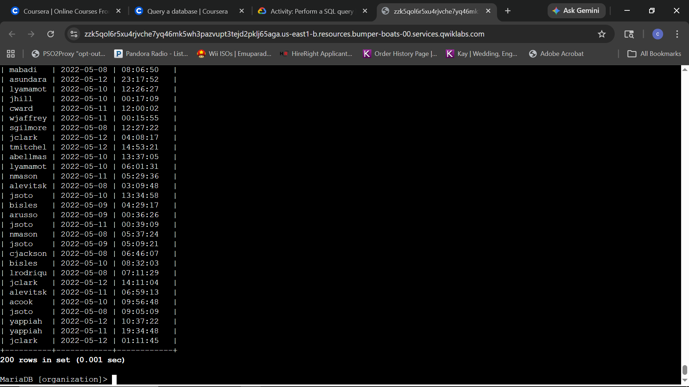**
*Audit verification: Comprehensive review of login timing for all 200 records.*

**Technical Analysis:**
Isolating `username`, `login_date`, and `login_time` provides the data necessary to detect anomalous after-hours activity. Identifying patterns of successful or failed logins during non-operational windows is a critical component of behavioral monitoring. This visibility allows for the rapid detection of potential account misuse or automated brute-force attempts occurring during low-supervision periods.

---

#### 2.3: Comprehensive Login Audit
The objective is to obtain a complete overview of all login attempt metadata to facilitate cross-field correlation and incident analysis.

**Query:**
```sql
SELECT * FROM log_in_attempts;
```

**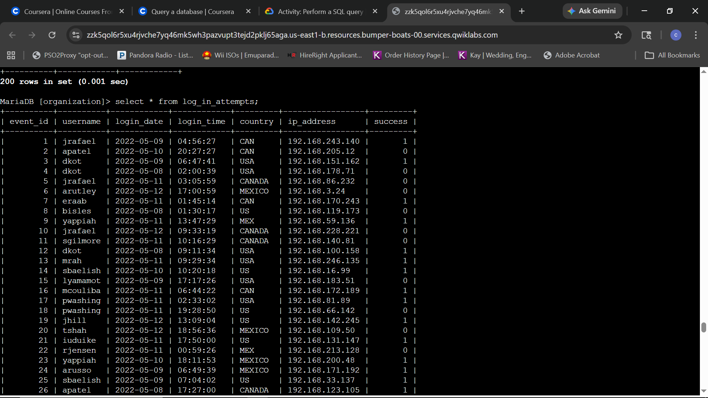**
*Holistic audit: Retrieving all available fields, including IP addresses and login success status.*

**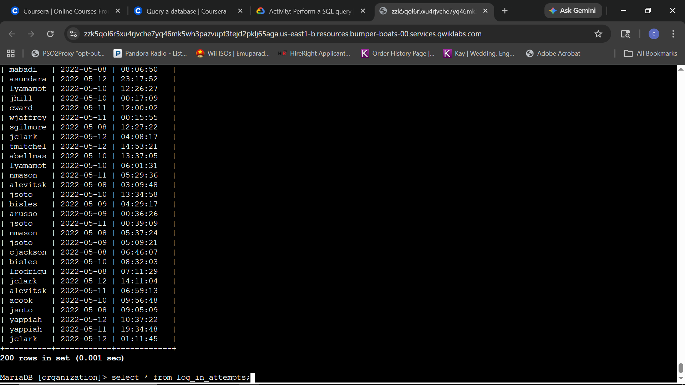**
*Audit verification: Full 200-record dataset successfully retrieved for deep forensic analysis.*

**Technical Analysis:**
Executing a wildcard `*` query on the `log_in_attempts` table is essential for correlating disparate data points like `ip_address` and the `success` flag. This comprehensive view allows for the identification of patterns that targeted queries might miss, such as multiple failed login attempts originating from a single IP across different usernames. This holistic approach ensures no critical telemetry is overlooked during a security investigation.

---

### Task 3: Order login attempts data

#### 3.1: Chronological Date Sequencing
The objective is to sort the login attempt records by date to establish a clear timeline of authentication events.

**Query:**
```sql
SELECT * FROM log_in_attempts ORDER BY login_date;
```

**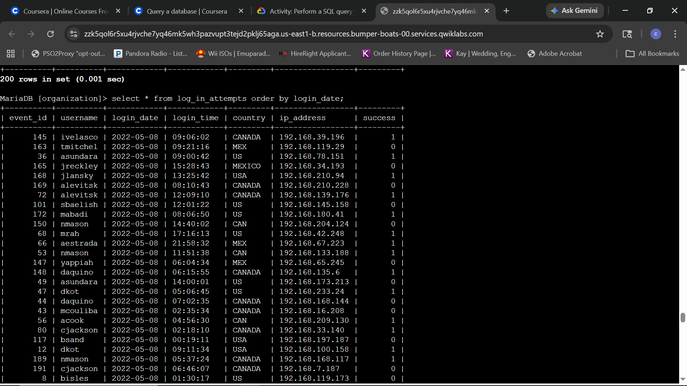**
*Temporal sequencing: Ordering logs by date to facilitate a chronological security review.*

**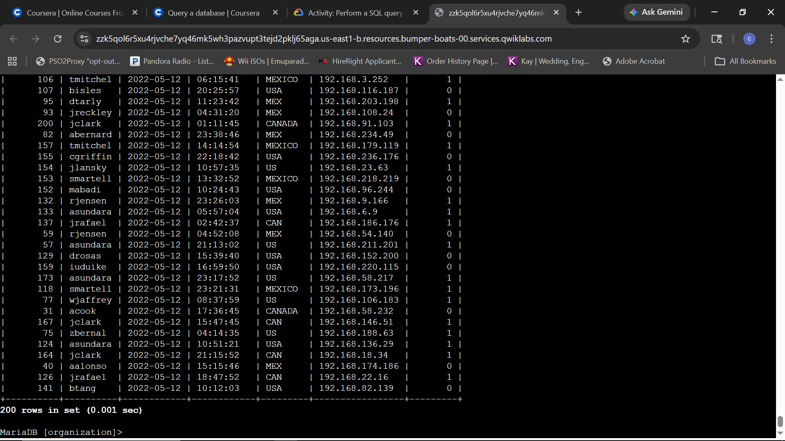**
*Audit verification: Successful sorting of all 200 records from the earliest to the most recent date entries.*

**Technical Analysis:**
Sorting by `login_date` is a fundamental requirement for forensic log analysis. By organizing the `log_in_attempts` table chronologically, it becomes possible to identify trends and specific days where login volume or failure rates deviate from the baseline. This organizational step is critical for reconstructing a timeline during incident response investigations.

---

#### 3.2: Granular Time-Series Analysis
The final objective is to refine the chronological audit by sequencing records by both date and time to provide a granular second-by-second timeline of events.

**Query:**
```sql
SELECT * FROM log_in_attempts ORDER BY login_date, login_time;
```

**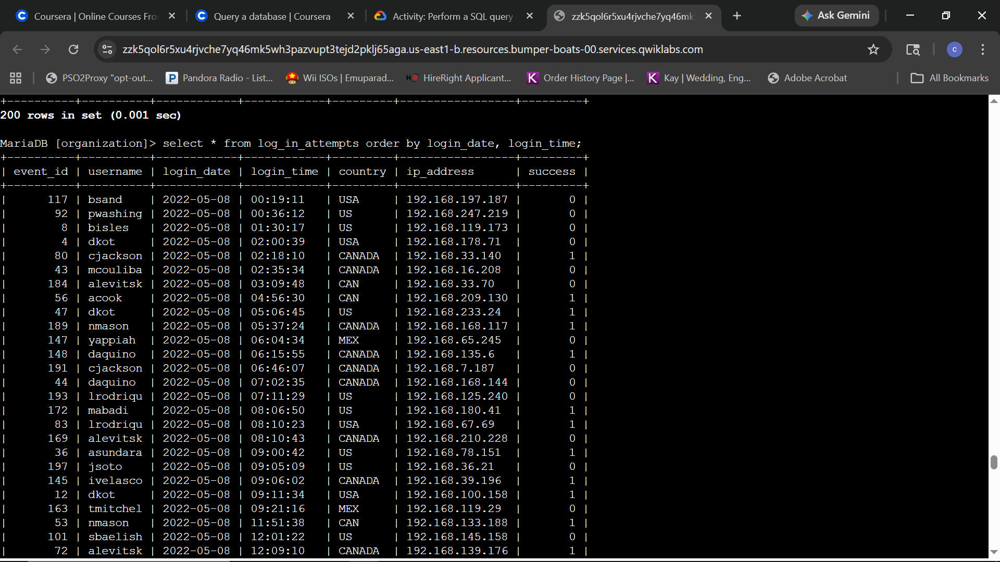**
*Granular sequencing: Applying a multi-level sort to organize logs by date and precise timestamp.*

**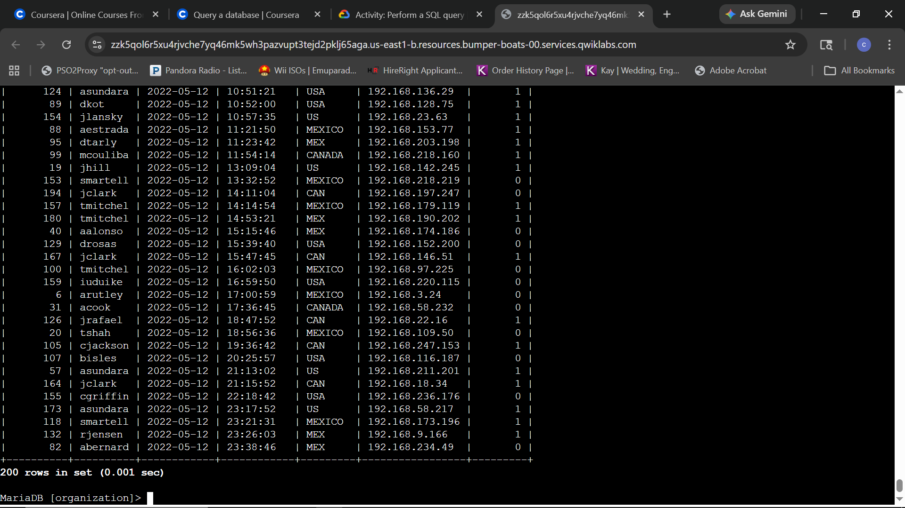**
*Forensic verification: Full 200-record dataset organized for high-fidelity timeline reconstruction.*

**Technical Analysis:**
Applying a multi-level sort using `ORDER BY login_date, login_time` provides the highest degree of granular visibility. This level of precision is critical for identifying high-frequency attack patterns, such as automated credential stuffing or brute-force attempts occurring within seconds. By organizing logs down to the specific second of entry, the forensic analysis can accurately map the progression of unauthorized access events.
