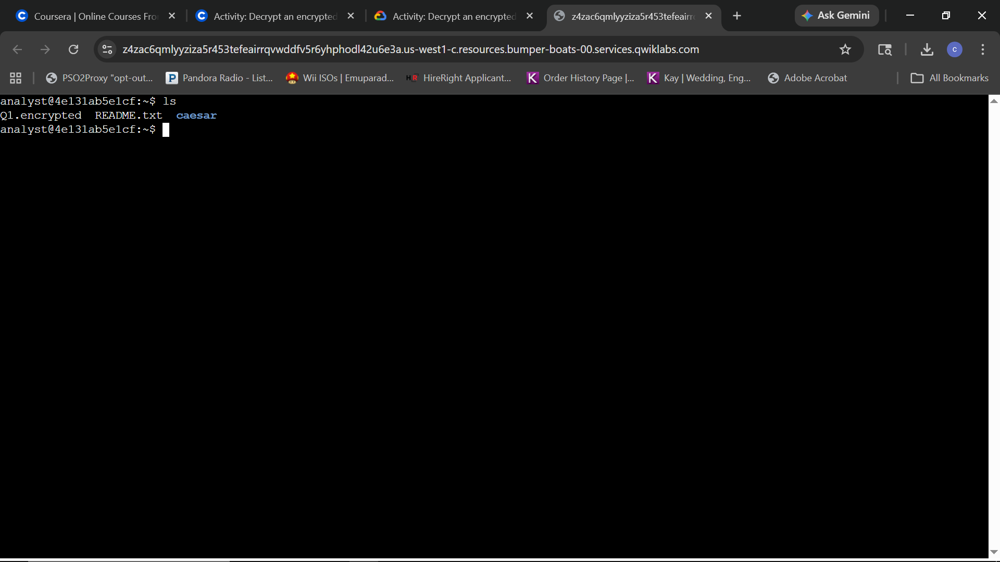
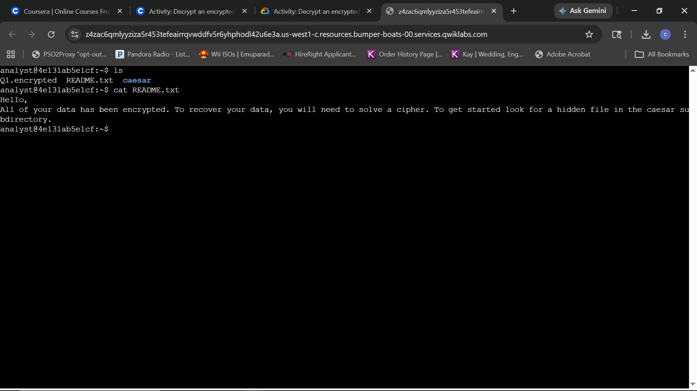
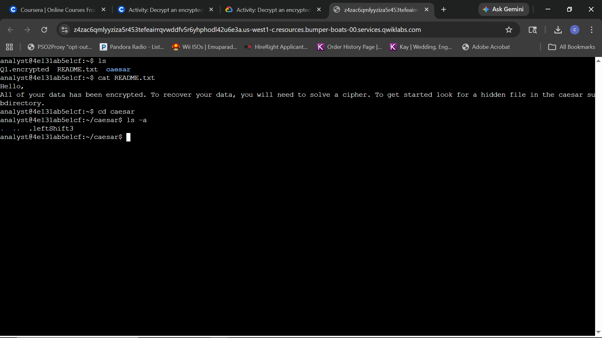
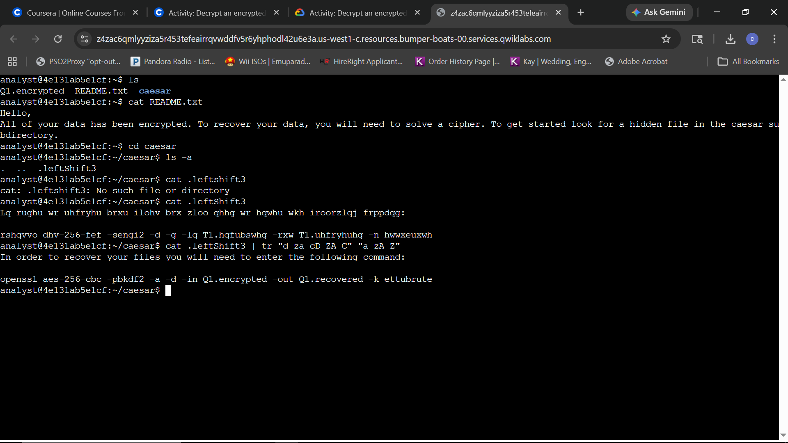
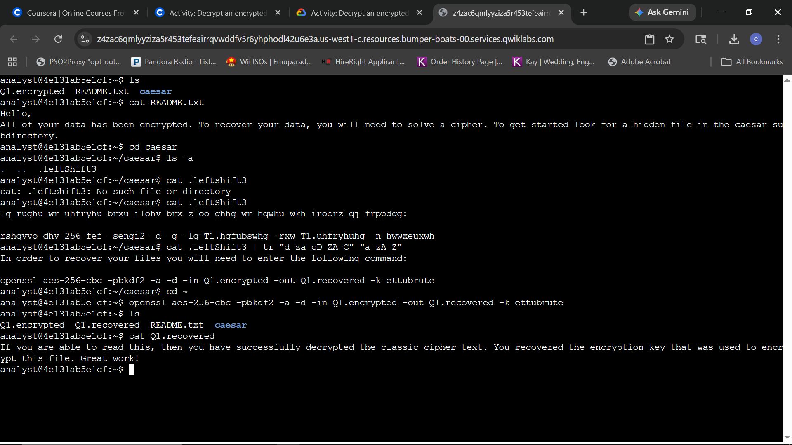

# Lab Report: Decrypt an encrypted message

## Scenario
**Objective:** All files within the home directory have been encrypted. Linux commands must be utilized to break the Caesar cipher and decrypt the files to access the hidden messages. The operation requires exploring the home directory contents, reading a specific configuration file, identifying a hidden directory asset, decrypting a Caesar cipher payload, and executing a final symmetric decryption sequence on the data file to restore operational assets.

---

### Task 1: Read the contents of a file
The working environment initializes within the `/home/analyst` directory. This step requires verifying the contents of the root workspace and parsing the primary configuration files for operational instructions.

**Query:**
```bash
ls
```


*Directory Discovery: Executing the listing command to inspect the baseline workspace files and subdirectories within the target user's home path.*

**Query:**
```bash
cat README.txt
```


*Instruction Ingestion: Displaying the contents of the text file to extract structural clues and locate the hidden directory path.*

**Technical Analysis:**
By conducting an initial assessment of the user's home workspace using the `ls` tool, the entry point file structure was established. Upon discovering `README.txt`, executing the `cat` command allowed for the retrieval of raw plain-text payload strings within the standard input stream. The message explicitly signals an active cryptographic incident affecting host file systems. It outlines a defensive pivot strategy targeting the `/home/analyst/caesar` subdirectory to uncover a hidden configuration file necessary for decryption sequencing.

---

### Task 2: Find a hidden file
This task requires shifting the active directory context into the hidden storage workspace, discovering hidden configuration files, and utilizing binary translation mechanisms to revert a Caesar cipher payload.

**Query:**
```bash
cd caesar
ls -a
```


*Hidden Asset Enumeration: Utilizing the all-inclusive listing flag to uncover hidden files beginning with a dot-prefix inside the target path.*

**Query:**
```bash
cat .leftShift3
cat .leftShift3 | tr "d-za-cD-ZA-C" "a-zA-Z"
```


*Cipher Mitigation and Session Normalization: Attempting file read execution with an initial lowercase casing error, followed by successful string dumping and character set translation to output the plaintext operational command.*

**Technical Analysis:**
Executing an environment audit using `ls -a` within the `caesar` directory confirmed the presence of a dot-prefixed hidden file named `.leftShift3`. An initial attempt to target the object resulted in a `No such file or directory` terminal warning due to case-sensitivity restrictions on the string argument. Standardizing input parameter casing to match the exact file metadata mapping allowed the `cat` utility to properly pipeline the obscured data buffer. 

The raw file content exhibited structural characteristics of a substitution cipher mechanism. To remediate this obfuscation vector, standard input streams were piped (`|`) into the character translation utility `tr`. By evaluating the static letter shifting scheme, explicit substitution boundaries were established using the argument matrices `"d-za-cD-ZA-C"` and `"a-zA-Z"`. This calculation offsets the three-space character translation, restoring the payload to clear-text format. The parsed payload exposed the complete symmetric cryptographic sequence and corresponding pass-phrase (`ettubrute`) required to decrypt the primary operational data volume.

---

### Task 3: Decrypt a file
This task requires navigating back to the parent directory path and deploying an explicit OpenSSL symmetric binary run-string to restore the compromised file assets to an unencrypted, structured format.

**Query:**
```bash
cd -
openssl aes-256-cbc -pbkdf2 -a -d -in Q1.encrypted -out Q1.recovered -k ettubrute
ls
cat Q1.recovered
```


*Symmetric Cryptographic Restoration: Executing a directory fallback action with a minor notation mistake, followed by accurate application of OpenSSL parameters to yield plaintext system data output.*

**Technical Analysis:**
The final sequence of the mitigation workflow began with an explicit directory regression. An initial execution input mapping `cd -` returned the active environment context back to the primary `/home/analyst` profile path instead of the user root directory. Once the terminal path was verified, the target payload `Q1.encrypted` was processed using the OpenSSL toolkit binary framework.

The command string utilized advanced block cipher configuration options. The operational flags invoked the `AES-256-CBC` algorithm standard to govern symmetric transformations. Additional constraints included `-pbkdf2` to enforce a secure password-based key derivation function mechanism, preventing brute-force shortcut exploits against the key stream. The execution used base64 or ASCII serialization text formatting (`-a`) and marked the operational action mode as decryption (`-d`). Passing the key parameter `-k ettubrute` allowed OpenSSL to successfully process the binary wrapper. The resulting plaintext output artifact `Q1.recovered` was committed directly to the storage volume. Final confirmation via the `cat` command exposed the readable file contents, validating the integrity of the data recovery process.
