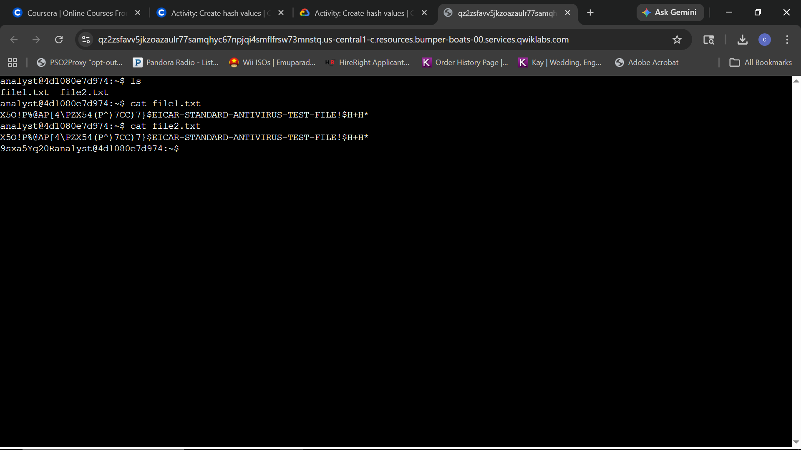
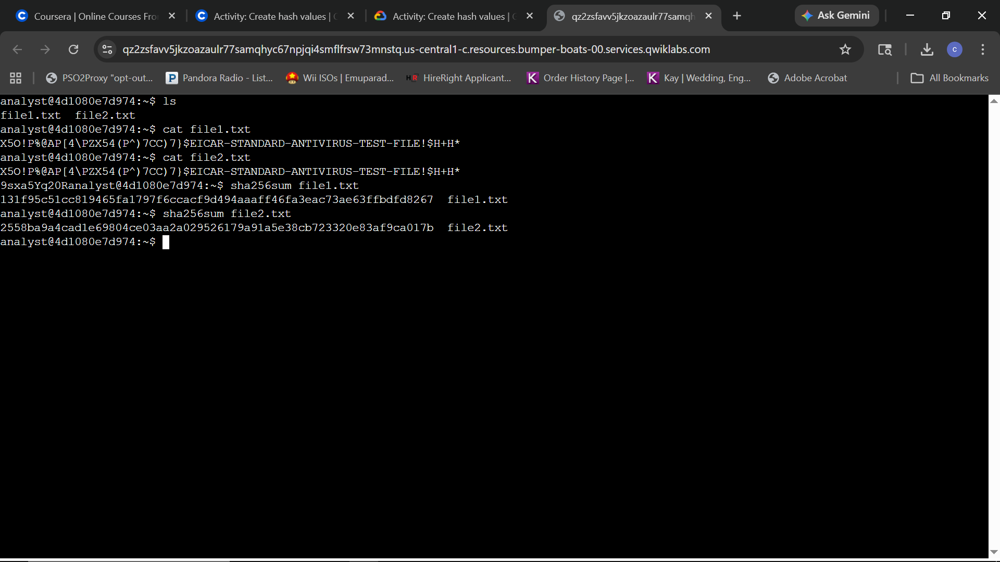
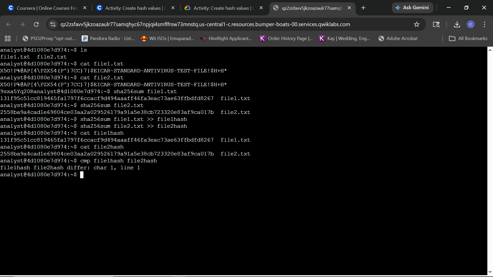

# Lab Report: Investigate file hashes

## Scenario
**Objective:** Investigate whether two files are identical or different by displaying the file contents, generating SHA-256 cryptographic hashes for each asset, and conducting a detailed comparison of the resulting checksum values.

---

### Task 1: Generate hashes for files
The workspace initializes within the `/home/analyst` directory. This directory contains two files, `file1.txt` and `file2.txt`. The task requires displaying the contents of each file, generating corresponding hash values, and exporting those values to new files for comparative analysis.

**Query:**
```bash
ls
cat file1.txt
cat file2.txt
```


*Workspace Discovery and File Inspection: Executing the directory listing command to reveal target txt files followed by cat operations to dump the raw text payloads of both operational assets to standard output.*

**Query:**
```bash
sha256sum file1.txt
sha256sum file2.txt
```


*Cryptographic Signature Generation: Computing the SHA-256 hash values for both text files to establish distinct cryptographic checksums despite apparent similarities in plain-text output.*

**Technical Analysis:**
An initial assessment of the user's workspace verified the presence of `file1.txt` and `file2.txt`. Utilizing the `cat` command retrieved the text strings, which visually matched the standardized EICAR anti-virus test file payload. Because visual identity does not guarantee mathematical equivalence, a cryptographic validation was performed. Executing the `sha256sum` hashing tool revealed two entirely different fixed-length alphanumeric signatures, proving that the underlying data streams differ.

---

### Task 2: Compare hashes
The generated cryptographic hashes are written to separate output files and systematically compared to identify structural and byte-level discrepancies between the assets.

**Query:**
```bash
sha256sum file1.txt >> file1hash
sha256sum file2.txt >> file2hash
cat file1hash
cat file2hash
cmp file1hash file2hash
```


*Cryptographic Comparison and Data Redirection: Redirecting hash outputs into separate files, verifying their contents via text dumping, and executing a byte-by-byte differential check to explicitly locate anomalies.*

**Technical Analysis:**
To preserve the cryptographic artifacts for granular analysis, the SHA-256 signatures were redirected from standard output into `file1hash` and `file2hash` using the append operator (`>>`). Executing the `cat` command confirmed the successful write operations and displayed the disparate string inputs. Finally, the `cmp` tool was leveraged to conduct a byte-by-byte comparison of the two signature logs. The command exposed a mismatch at character 1, line 1, programmatically confirming that the original source text assets are fundamentally non-identical despite their matching visual strings.
